---
## Front matter
lang: ru-RU
title: Лабораторная работа №1
subtitle: 'Установка и конфигурация операционной системы на виртуальную машину'
author: 'Румянцева Александра Сергеевна'
date: 18 сентября, 2021

## Formatting
toc: false
slide_level: 2
theme: metropolis
mainfont: Ubuntu
romanfont: Ubuntu
sansfont: Ubuntu
monofont: Ubuntu
header-includes: 
 - \metroset{progressbar=frametitle,sectionpage=progressbar,numbering=fraction}
 - '\makeatletter'
 - '\beamer@ignorenonframefalse'
 - '\makeatother'
aspectratio: 43
section-titles: true
---

## Цель работы

Приобретение практических навыков установки операционной системы на виртуальную машину, настройки минимально необходимых для дальнейшей работы сервисов.

## Задание

Лабораторная работа подразумевает установку на виртуальную машину VirtualBox (https://www.virtualbox.org/) операционной системы Linux, дистрибутив Centos.

## Выполнение лабораторной работы

1. Запускаю _Virtual Box_, создаю новую виртуальную машину с именем **_Base_**: выбираю тип операционной системы _Linux_, а также версию _Red Hat_ (рис. 1).

   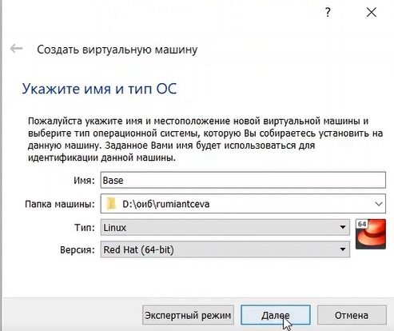{ #fig:001 width=50% }

---

2. Указываю объем памяти 1024 МБ. Задаю конфигурацию жесткого диска: создаю новый динамический виртуальный жёсткий диск типа VDI размером 40 ГБ и его расположение (рис. 2-3).

   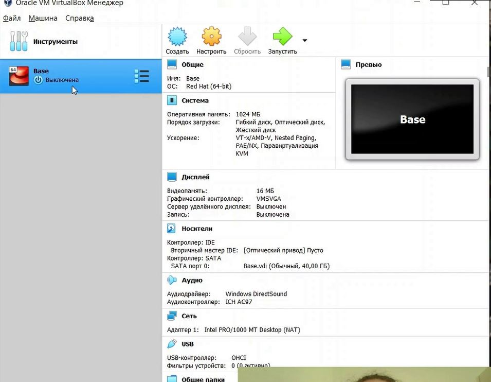{ #fig:002 width=50% }

---

   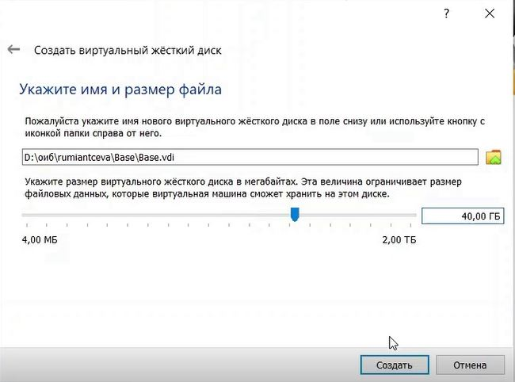{ #fig:003 width=50% }

---

4. Добавляю во вкладке _"Носители"_ свойств виртулальной машины новый привод оптических дисков, выбираю нужный образ для установки операционной системы (рис. 4).

   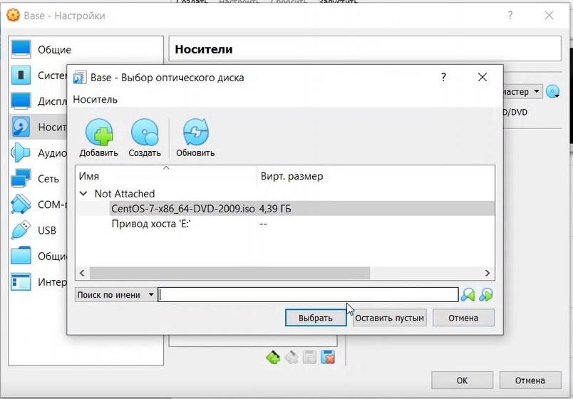{ #fig:004 width=50% }

---

5. Запускаю созданную виртуальную машину и начинаю установку. Провожу конфигурацию параметров будущей ОС в соответствии с требованиями (рис. 5).

   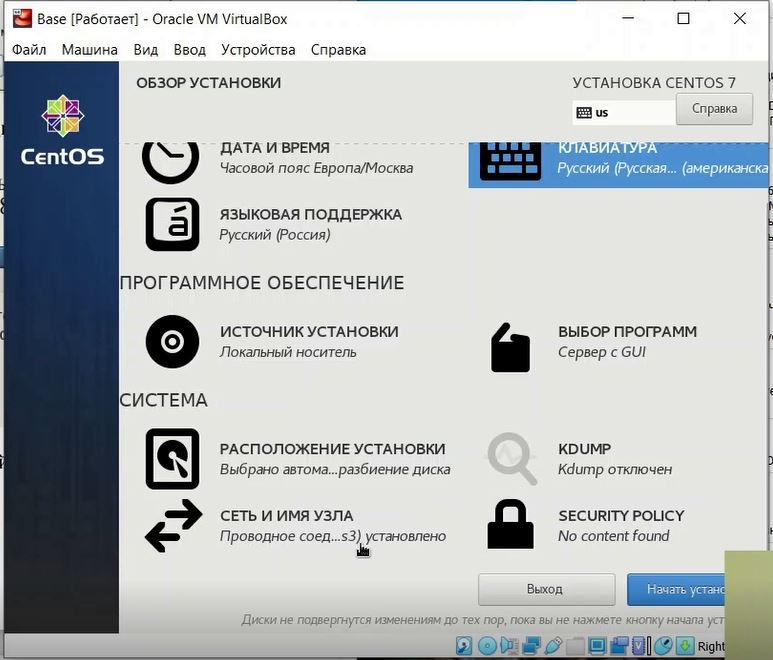{ #fig:005 width=50% }

---

6. Создаю нового пользователя с правами администратора, задаю пароль.(рис.6-7).

   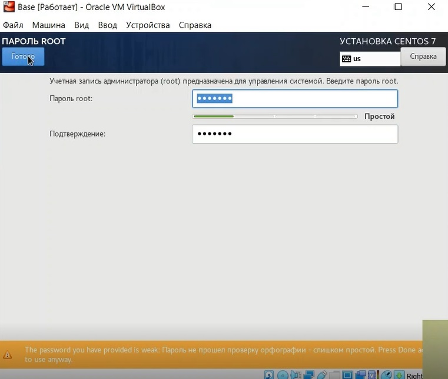{ #fig:006 width=50% }

---

   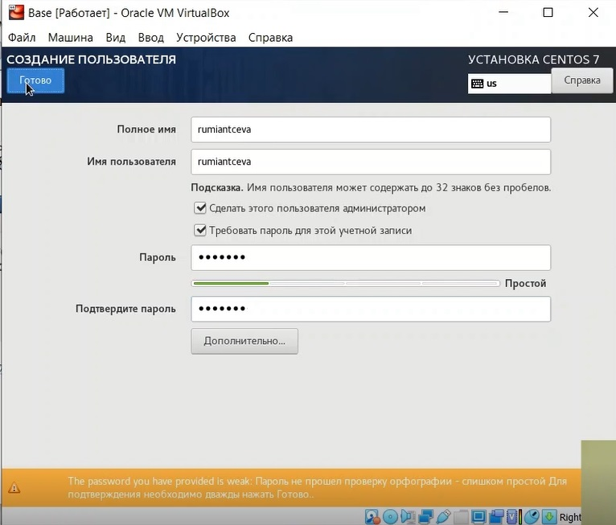{ #fig:007 width=50% }

---

7. Продолжаю установку операционной системы, перезагружаю виртуальную машину по требованию установщика. Принимаю лицензионное соглашение (рис.8).

   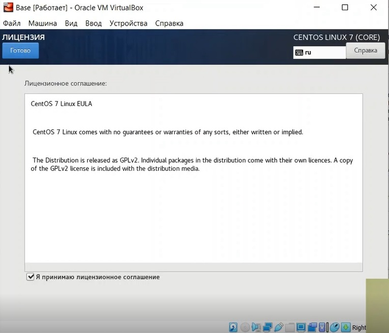{ #fig:008 width=50% }

8. Вхожу в созданный профиль.

---

9. Произвожу установку драйверов (рис. 9)

   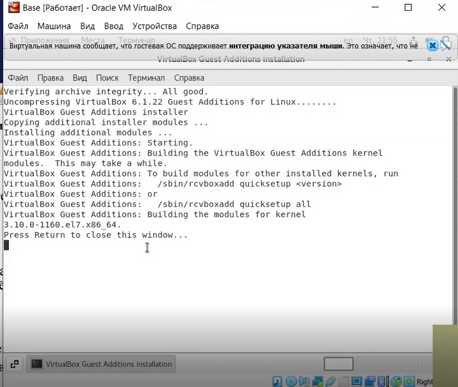{ #fig:009 width=60% }

10. После установки выполняю перезагрузку.

## Результат установки

   { #fig:010 width=60% }

---

11. Открываю терминал, перехожу на **_root_** пользователя командой _su_, обновляю системные файлы _yum update_, устанавливаю mc командой _yum install mc_ (рис.11).

   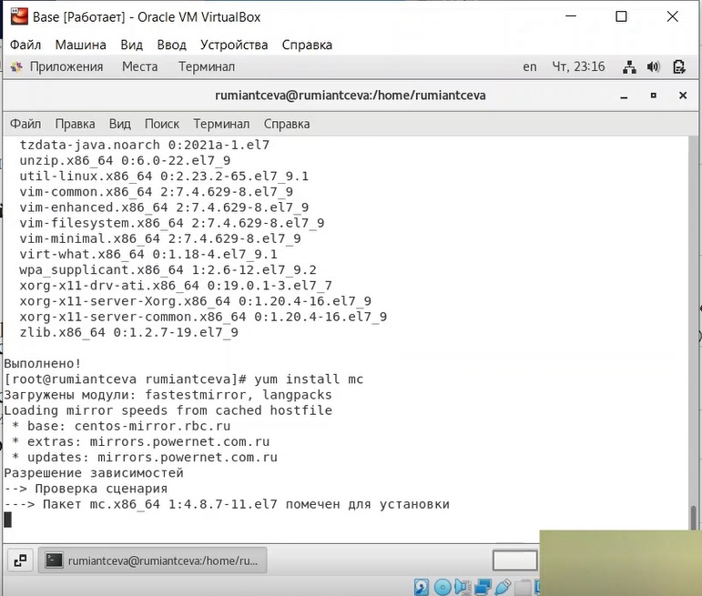{ #fig:011 width=60% }

12. Завершаю работу виртуальной машины.

---

13. Освобождаю «Base.dvi»,чтобы другие виртуальные машины могли использовать машину Base и её конфигурацию как базовую (рис. 12).

   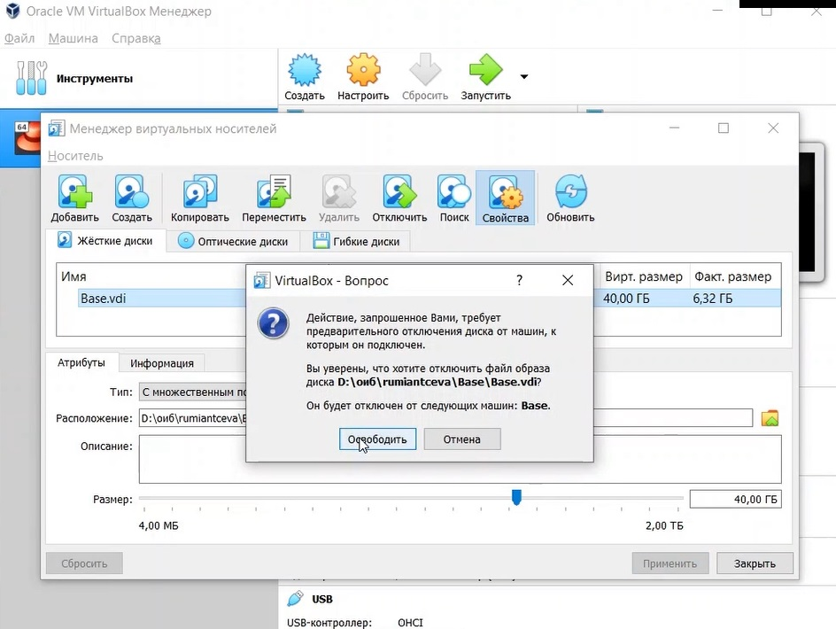{ #fig:012 width=60% }

---

14. На основе виртуальной машины Base создаем машину Host2, выбрав в качестве диска существующий жёсткий диск (рис. 13).

   { #fig:013 width=60% }

## Выводы

Приобрела практические навыки установки операционной системы на виртуальную машину, настройки минимально необходимых для дальнейшей работы сервисов.

