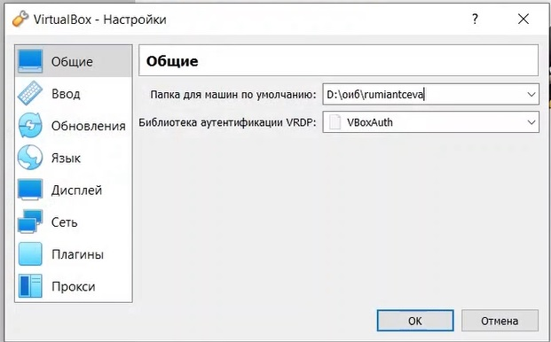
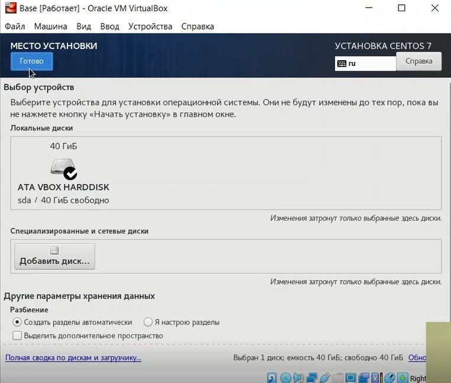
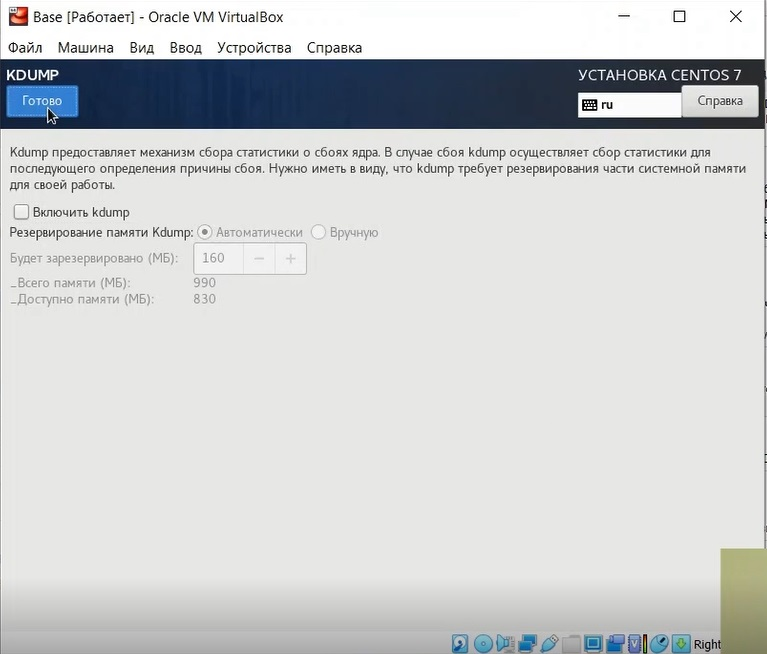

---
# Front matter
lang: ru-RU
title: 'Отчёт по лабораторной работе 1'
subtitle: 'Установка и конфигурация операционной системы на виртуальную машину'
author: 'Румянцева Александра Сергеевна'

# Formatting
toc-title: 'Содержание'
toc: true # Table of contents
toc_depth: 2
lof: true # List of figures
lot: true # List of tables
fontsize: 12pt
linestretch: 1.5
papersize: a4paper
documentclass: scrreprt
polyglossia-lang: russian
polyglossia-otherlangs: english
mainfont: Ubuntu
romanfont: Ubuntu
sansfont: Ubuntu
monofont: Ubuntu
mainfontoptions: Ligatures=TeX
romanfontoptions: Ligatures=TeX
sansfontoptions: Ligatures=TeX,Scale=MatchLowercase
monofontoptions: Scale=MatchLowercase
indent: true
pdf-engine: lualatex
header-includes:
  - \linepenalty=10 # the penalty added to the badness of each line within a paragraph (no associated penalty node) Increasing the value makes tex try to have fewer lines in the paragraph.
  - \interlinepenalty=0 # value of the penalty (node) added after each line of a paragraph.
  - \hyphenpenalty=50 # the penalty for line breaking at an automatically inserted hyphen
  - \exhyphenpenalty=50 # the penalty for line breaking at an explicit hyphen
  - \binoppenalty=700 # the penalty for breaking a line at a binary operator
  - \relpenalty=500 # the penalty for breaking a line at a relation
  - \clubpenalty=150 # extra penalty for breaking after first line of a paragraph
  - \widowpenalty=150 # extra penalty for breaking before last line of a paragraph
  - \displaywidowpenalty=50 # extra penalty for breaking before last line before a display math
  - \brokenpenalty=100 # extra penalty for page breaking after a hyphenated line
  - \predisplaypenalty=10000 # penalty for breaking before a display
  - \postdisplaypenalty=0 # penalty for breaking after a display
  - \floatingpenalty = 20000 # penalty for splitting an insertion (can only be split footnote in standard LaTeX)
  - \raggedbottom # or \flushbottom
  - \usepackage{float} # keep figures where there are in the text
  - \floatplacement{figure}{H} # keep figures where there are in the text
---

# Цель работы

Приобретение практических навыков установки операционной системы на виртуальную машину, настройки минимально необходимых для дальнейшей работы сервисов.

# Задание

Лабораторная работа подразумевает установку на виртуальную машину VirtualBox (https://www.virtualbox.org/) операционной системы Linux, дистрибутив Centos.

# Выполнение лабораторной работы

1. Запускаю _Virtual Box_, задаю располодение для виртуальных машин в папке с _rumiantceva_ (рис.1), и выбираю удобную для меня клавишу управления: _Right_ _Ctrl_ (рис. 2).

   { #fig:001 width=60% }

   { #fig:002 width=60% }

2. Создаю новую виртуальную машину с именем **_Base_**: выбираю тип операционной системы _Linux_, а также версию _Red Hat_ (рис.3).

   { #fig:003 width=60% }

3. Указываю объем памяти 1024 МБ (рис.4).

   { #fig:004 width=60% }

4. Задаю конфигурацию жесткого диска: создаю новый динамический виртуальный жёсткий диск типа VDI, а также размер диска - 40 ГБ и его расположение (рис.5-8).

   { #fig:005 width=60% }

   { #fig:006 width=60% }

   { #fig:007 width=60% }

   { #fig:008 width=60% }

5. Добавляю во вкладке _"Носители"_ свойств виртулальной машины новый привод оптических дисков, выбираю нужный образ для установки операционной системы (рис.9).

   { #fig:009 width=60% }

6. Запускаю созданную виртуальную машину и начинаю установку (рис.10). Выбираю язык, который буду использовать в процессе установки: русский язык (рис. 11). 

   { #fig:010 width=60% }

   { #fig:011 width=60% }

7. Провожу конфигурацию параметров будущей ОС в соответствии с требованиями (рис. 12):
	- дата и время: выбираю москвский часовой пояс (рис. 13)
	- язык для клавиатуры и языковой поддержки: оставляю русский язык (рис. 14)
	- источник установки: локальный носитель (рис. 15)
	- выбор программы: выбираю сервер с GUI (средства разработки) (рис. 16)
	- расположение установки: автоматическое разбиение диска (рис. 17)
	- KDUMP: kdump отключен (рис. 18)
	- сеть и имя узла: включила сеть и задала имя узла со своим именем (рис. 19)
	- security policy: no content found (рис. 20)

   { #fig:012 width=60% }

   { #fig:013 width=60% }

   { #fig:014 width=60% }

   { #fig:015 width=60% }

   { #fig:016 width=60% }

   { #fig:017 width=60% }

   { #fig:018 width=60% }

   { #fig:019 width=60% }

   { #fig:020 width=60% }

8. Создаю нового пользователя с правами администратора, задаю пароль (рис.21-23).

   { #fig:021 width=60% }

   { #fig:022 width=60% }

   { #fig:023 width=60% }

9. Продолжаю установку операционной системы, перезагружаю виртуальную машину по требованию установщика. Принимаю лицензионное соглашение (рис.24).

   { #fig:024 width=60% }

10. Вхожу в созданный ранее профиль, открывается привычный графический интерфейс (рис.25).

   { #fig:025 width=60% }

11. Произвожу установку драйверов. Для этого заходим в устройства -> подключить образ диска Дополнительной гостевой ОС (рис. 26), нажимаем запустить (рис. 27) и вводим пароль (рис. 28). происходит установка (рис. 29).

   { #fig:026 width=60% }

   { #fig:027 width=60% }

   { #fig:028 width=60% }

   { #fig:029 width=60% }

12. После установки выполняю перезагрузку (рис. 30).

   { #fig:030 width=60% }

13. Открываю терминал, перехожу на **_root_** пользователя командой _su_, обновляю системные файлы _yum update_, устанавливаю mc командой _yum install mc_ (рис.31-33).

   { #fig:031 width=60% }

   { #fig:032 width=60% }

   { #fig:033 width=60% }

14. Завершаю работу виртуальной машины (рис. 34).

   { #fig:034 width=60% }

15. Освобождаю «Base.dvi»,чтобы другие виртуальные машины могли использовать машину Base и её конфигурацию как базовую (рис. 35).

   { #fig:035 width=60% }

16. На основе виртуальной машины Base создаем машину Host2, выбрав в качестве диска существующий жёсткий диск (рис. 36-37).

   { #fig:036 width=60% }

   { #fig:037 width=60% }

# Выводы

Приобрела практические навыки установки операционной системы на виртуальную машину, настройки минимально необходимых для дальнейшей работы сервисов.
