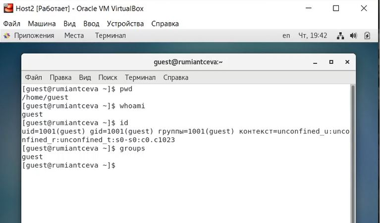
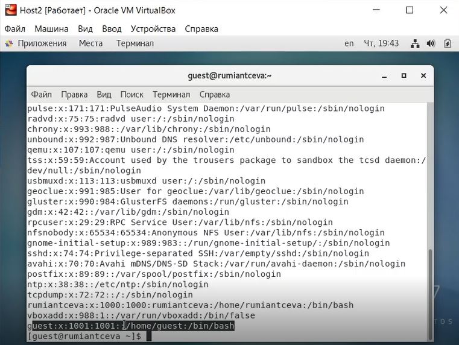
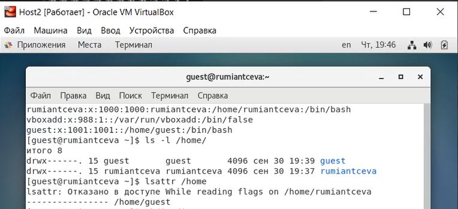
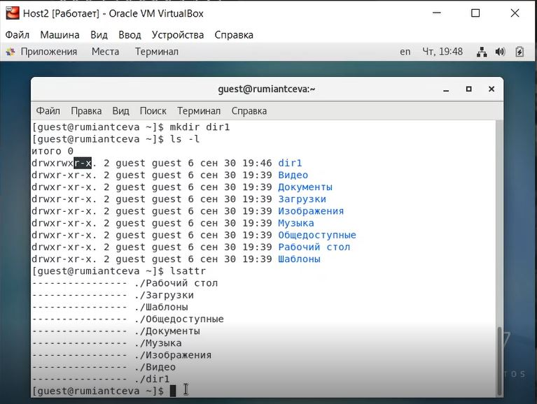
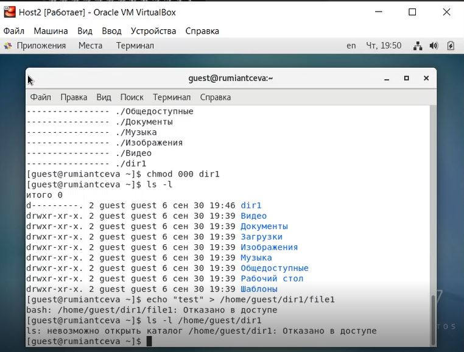
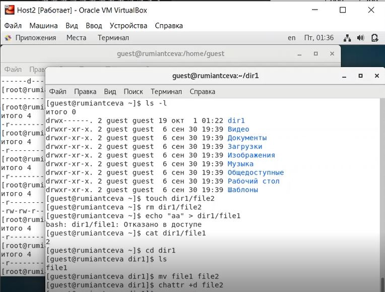
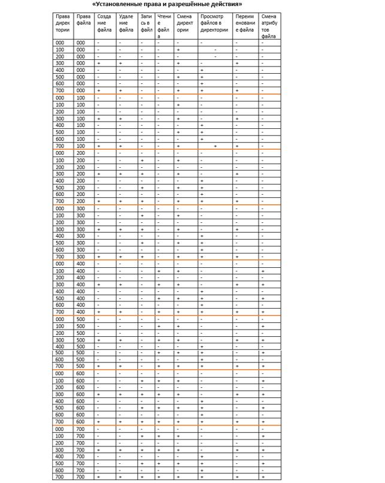

---
## Front matter
lang: ru-RU
title: Лабораторная работа №2
subtitle: 'Дискреционное разграничение прав в Linux. Основные атрибуты'
author: 'Румянцева Александра Сергеевна'
date: 1 октября, 2021

## Formatting
toc: false
slide_level: 2
theme: metropolis
mainfont: Ubuntu
romanfont: Ubuntu
sansfont: Ubuntu
monofont: Ubuntu
header-includes: 
 - \metroset{progressbar=frametitle,sectionpage=progressbar,numbering=fraction}
 - '\makeatletter'
 - '\beamer@ignorenonframefalse'
 - '\makeatother'
aspectratio: 43
section-titles: true
---

## Цель работы

Получение практических навыков работы в консоли с атрибутами файлов, закрепление теоретических основ дискреционного разграничения доступа в современных системах с открытым кодом на базе ОС Linux.

## Задание

Лабораторная работа подразумевает изучение установленных прав и разрешённых действий над файлами и директориями опытным путем, определение минимальных прав для операций.

## Выполнение лабораторной работы

1-2. Создала учётную запись пользователя guest и задала пароль для него (рис. 1).

   { #fig:001 width=60% }

3. Вошла в систему от имени пользователя guest.

---

4-7. Определила директорию, в которой нахожусь, командой pwd. Уточнила имя пользователя командой whoami. Уточнила имя пользователя, его группу, а также группы, куда входит пользователь, командой id (рис. 2).

   { #fig:002 width=60% }

---

8. Просмотрела файл /etc/passwd командой cat /etc/passwd. Нашла в нём свою учётную запись (рис. 3). uid пользователя равен 1001, gid пользователя равен 1001, что совпадает с резутьтатами выполнения команд, которые мы получили в предыдущих пунктах.

   { #fig:003 width=60% }

---

9-10. Определила существующие в системе директории командой ls -l /home/ и проверила, какие расширенные атрибуты установлены на поддиректориях, находящихся в директории /home, командой lsattr /home (рис. 4).

   { #fig:004 width=60% }

---

11.  Создала в домашней директории поддиректорию dir1 командой mkdir dir1. С помощью команд ls -l и lsattr посмотрела, какие права доступа и расширенные атрибуты были выставлены на директорию dir1 (рис.5).

   { #fig:005 width=60% }

---

12-13. Сняла с директории dir1 все атрибуты. Попыталась создать в директории dir1 файл file1 командой echo "test" > /home/guest/dir1/file1. Данное действие выполнить не удалось из-за отсутствия доступа (рис. 6).

   { #fig:006 width=60% }

---

14. Заполнила таблицу 1 опытным путём.

Команды для проверки, котрые я использовала:
	- touch - проверка на создание файла
	- rm - проверка на удаление файла
	- echo - проверка на запись в файл
	- cat - проверка на чтение файла
	- cd - проверка на доступ в директорию
	- ls - проверка на просмотр файлов в директории
	- mv - проверка на переименование файла
	- chattr - проверка добавление атрибутов

Для смены и задания прав на файл или директорию я использовала команду chmod.

---

   { #fig:007 width=60% }

---

   { #fig:008 width=60% }

## 15.  На основании заполненной таблицы опредяю минимально необходимые права для выполнения операций внутри директории dir1.

   |       Операция       |Мин. права на директорию| Мин. права на файл |
   |:-------------------- |:----------------------:| ------------------:|
   |    Создание файла    |           300          |        000         |
   |    Удаление файла    |           300          |        000         |
   |     Чтение файла     |           100          |        400         |
   |     Запись в файл    |           300          |        200         |
   | Переименование файла |           300          |        000         |
   |Создание поддиректории|           300          |         -          |
   |Удаление поддиректории|           300          |         -          |

## Выводы

Я получила практические навыки работы в консоли с атрибутами файлов, закрепила теоретические основы дискреционного разграничения доступа в современных системах с открытым кодом на базе ОС Linux1.

