---
# Front matter
lang: ru-RU
title: 'Отчёт по лабораторной работе 2'
subtitle: 'Дискреционное разграничение прав в Linux. Основные атрибуты'
author: 'Румянцева Александра Сергеевна'

# Formatting
toc-title: 'Содержание'
toc: true # Table of contents
toc_depth: 2
lof: true # List of figures
lot: true # List of tables
fontsize: 12pt
linestretch: 1.5
papersize: a4paper
documentclass: scrreprt
polyglossia-lang: russian
polyglossia-otherlangs: english
mainfont: PT Serif
romanfont: PT Serif
sansfont: PT Sans
monofont: PT Mono
mainfontoptions: Ligatures=TeX
romanfontoptions: Ligatures=TeX
sansfontoptions: Ligatures=TeX,Scale=MatchLowercase
monofontoptions: Scale=MatchLowercase
indent: true
pdf-engine: lualatex
header-includes:
  - \linepenalty=10 # the penalty added to the badness of each line within a paragraph (no associated penalty node) Increasing the value makes tex try to have fewer lines in the paragraph.
  - \interlinepenalty=0 # value of the penalty (node) added after each line of a paragraph.
  - \hyphenpenalty=50 # the penalty for line breaking at an automatically inserted hyphen
  - \exhyphenpenalty=50 # the penalty for line breaking at an explicit hyphen
  - \binoppenalty=700 # the penalty for breaking a line at a binary operator
  - \relpenalty=500 # the penalty for breaking a line at a relation
  - \clubpenalty=150 # extra penalty for breaking after first line of a paragraph
  - \widowpenalty=150 # extra penalty for breaking before last line of a paragraph
  - \displaywidowpenalty=50 # extra penalty for breaking before last line before a display math
  - \brokenpenalty=100 # extra penalty for page breaking after a hyphenated line
  - \predisplaypenalty=10000 # penalty for breaking before a display
  - \postdisplaypenalty=0 # penalty for breaking after a display
  - \floatingpenalty = 20000 # penalty for splitting an insertion (can only be split footnote in standard LaTeX)
  - \raggedbottom # or \flushbottom
  - \usepackage{float} # keep figures where there are in the text
  - \floatplacement{figure}{H} # keep figures where there are in the text
---

# Цель работы

Получение практических навыков работы в консоли с атрибутами файлов, закрепление теоретических основ дискреционного разграничения доступа в современных системах с открытым кодом на базе ОС Linux.

# Задание

Лабораторная работа подразумевает изучение установленных прав и разрешённых действий над файлами и директориями опытным путем, определение минимальных прав для операций.

# Теория

Изучим, что представляют из себя права доступа в Linux.

Права доступа имеют всего 3 опции − чтение, запись и запуск на выполнение, устанавливаемые для владельца, группы и прочих пользователей (для папки запуск на выполнение означает просмотр содержимого − списка файлов и вложенных папок).

Права можно задавать либо буквами r (read), w (Write) и x (eXecute), либо в двоичной системе (точнее в восьмеричной с использованием цифр от 0 до 7, но на основе двоичной системы).

Праву на чтение (r) соответствует значение 4, записи (w) − 2 и выполнению/просмотру файлов (x) − 1. Комбинируя эти значения, можно получать разные права. Например:
	
	- 6 = (4 + 2) − чтение и запись

	- 5 = (4 + 1) − чтение и исполнение

Первыми задаются права доступа для владельца, затем для группы и в конце для всех прочих.

Обычно для документов и файлов данных устанавливаются права 644 или 664. Это означает, что владелец может читать и изменять файл (включая удаление), члены группы в первом случае только читать, а во втором изменять, а все прочие − только читать.

Для исполняемых файлов и папок обычно задаются права 755 или 775. Значения те же, что и в предыдущем абзаце плюс присутствует право на выполнение или просмотр списка вложенных объектов.

Если задавать права доступа буквами, то указываются нужные права в виде rwx, а то, что нужно пропустить, заменяется дефисом. То есть, 644 соответствует rw-r--r--, а 755 − rwxr-xr-x.

# Выполнение лабораторной работы

1. В установленной при выполнении предыдущей лабораторной работы операционной системе создала учётную запись пользователя guest с помощью команды useradd guest (рис. 1).

2. Задала пароль для пользователя guest командой passwd guest (рис. 1).

   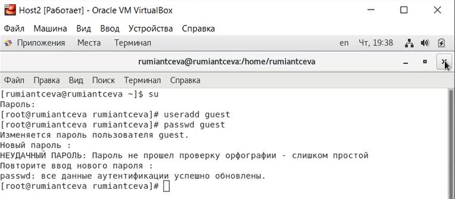{ #fig:001 width=60% }

3. Вошла в систему от имени пользователя guest (рис. 2).

   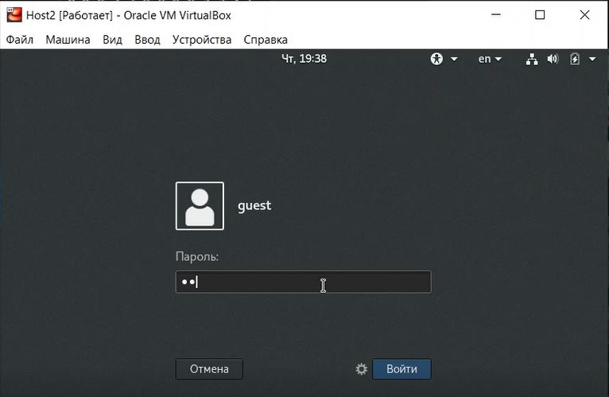{ #fig:002 width=60% }

4. Определила директорию, в которой нахожусь, командой pwd.

Директория совспадает с приглашением командной строки, она является моей домашней директорией (видно по знаку тильды) (рис. 3).

5. Уточнила имя пользователя командой whoami(рис. 3). Видно, что имя пользователя guest.

6. Уточнила имя пользователя, его группу, а также группы, куда входит пользователь, командой id (рис. 3).

Видно, что имя пользователя guest, uid = 1001, его группа guest, gid = 1001, он входит только в группу 1001 (guest), то есть только в свою группу.

Сравнила вывод id с выводом команды groups. Команда groups так же вывела одну группу guest

   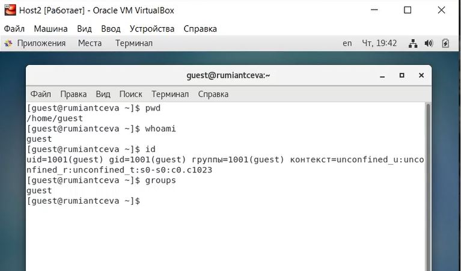{ #fig:003 width=60% }

7. Сравнила полученную информацию об имени пользователя с данными, выводимыми в приглашении командной строки. Имя пользователя во всех командах выводится как guest, что совпадает с именем в приглашении командной строки.

8. Просмотрела файл /etc/passwd командой cat /etc/passwd. Нашла в нём свою учётную запись (рис. 4).

Видим, что uid пользователя равен 1001, gid пользователя равен 1001, что совпадает с резутьтатами выполнения команд, которые мы получили в предыдущих пунктах.

   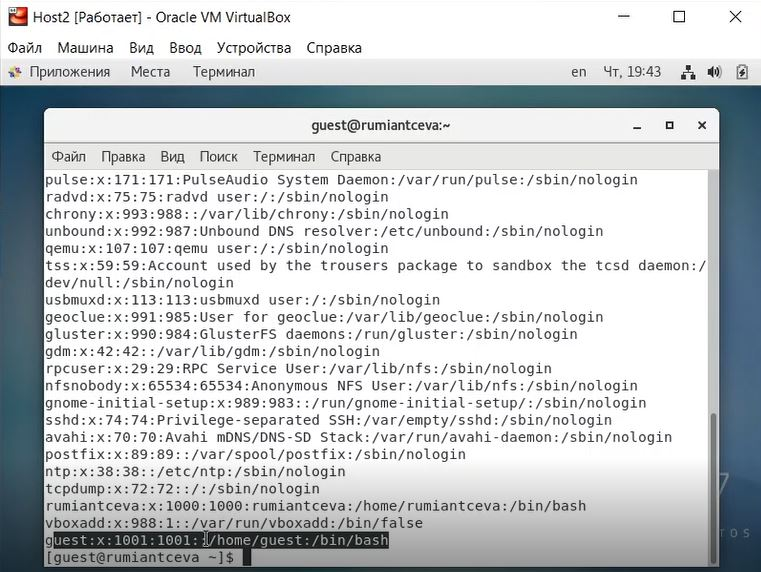{ #fig:004 width=60% }

9. Определила существующие в системе директории командой ls -l /home/ (рис. 5). Мне удалось получить список поддиректорий директории /home. На директориях rumiantceva и guest установленны права 700.

10. Проверила, какие расширенные атрибуты установлены на поддиректориях, находящихся в директории /home, командой lsattr /home (рис. 5).

С помощью данной команды мне удалось увидеть расширенные атрибуты директории guest, то есть пользователя, в которм я нахожусь. Нo не удалось увидеть расширенные атрибуты директории rumiantceva, отказано в доступе (что соответствует пункту выше).

   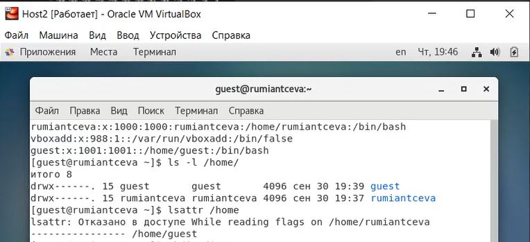{ #fig:005 width=60% }

11.  Создала в домашней директории поддиректорию dir1 командой mkdir dir1. С помощью команд ls -l и lsattr посмотрела, какие права доступа и расширенные атрибуты были выставлены на директорию dir1 (рис.6).

Видим, что директория dir1 создана, кроме того, с помощью команды ls -l видим, что права у dir1 775, то есть для чтения, записи и исполнения для пользователя и групп, и только чтениеи исполнение для остальных пользователей. С помащью команды lsattr видим, что расширенных атрибутов нет.

   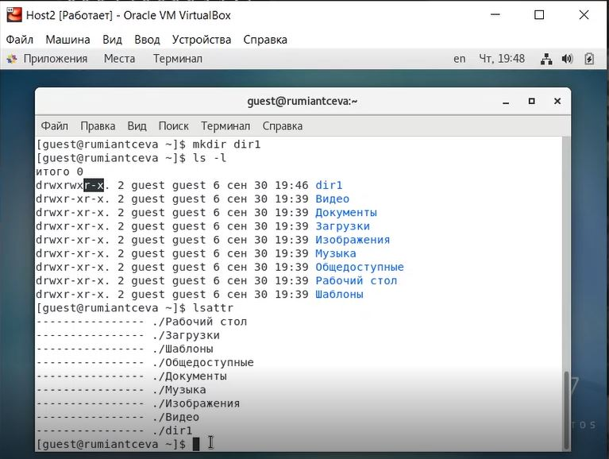{ #fig:006 width=60% }

12. Сняла с директории dir1 все атрибуты командой chmod 000 dir1 и проверила её правильность с помощью выполнения команды ls -l. Дейстительно, права стали 000 (рис.7).

13. Попыталась создать в директории dir1 файл file1 командой echo "test" > /home/guest/dir1/file1. Данное действие выполнить не удалось из-за отсутствия доступа, так как мы сами сняли все права с директории dir1 в пункте выше (рис. 7).

Попробовала командой ls -l /home/guest/dir1 проверить создание файла, так как у нас права dir1 установленны как 000, следовательно просмотреть что есть в dir1 не получилось (рис. 7). Поэтому я проверила создание файла file1 внутри директории dir1 под root (рис. 8). Видно, что всё же файл не был создан.

   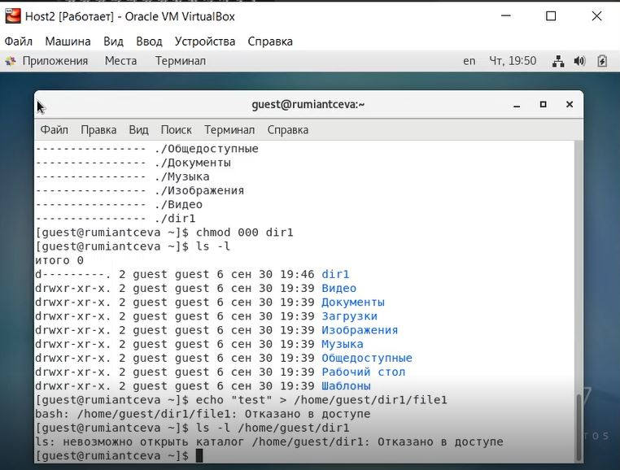{ #fig:007 width=60% }

   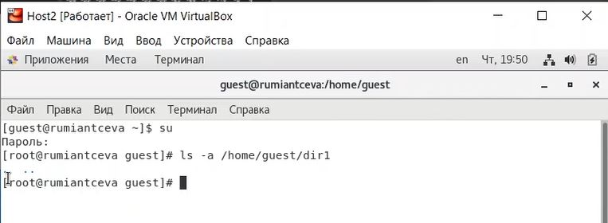{ #fig:008 width=60% }

14. Заполнила таблицу 1 опытным путём.

Команды для проверки, котрые я использовала:

	- touch - проверка на создание файла

	- rm - проверка на удаление файла

	- echo - проверка на запись в файл

	- cat - проверка на чтение файла

	- cd - проверка на доступ в директорию

	- ls - проверка на просмотр файлов в директории

	- mv - проверка на переименование файла

	- chattr - проверка добавление атрибутов

Для смены и задания прав на файл или директорию я использовала команду chmod. Пример выполнения одного из 64 случаев на рисунке 9 для случая 700 / 400 на риунке 9. Таким образом заполнялась вся таблица (рис. 10).

   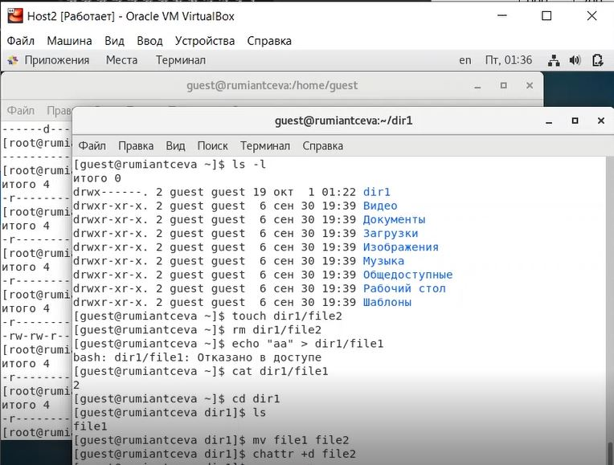{ #fig:009 width=60% }

   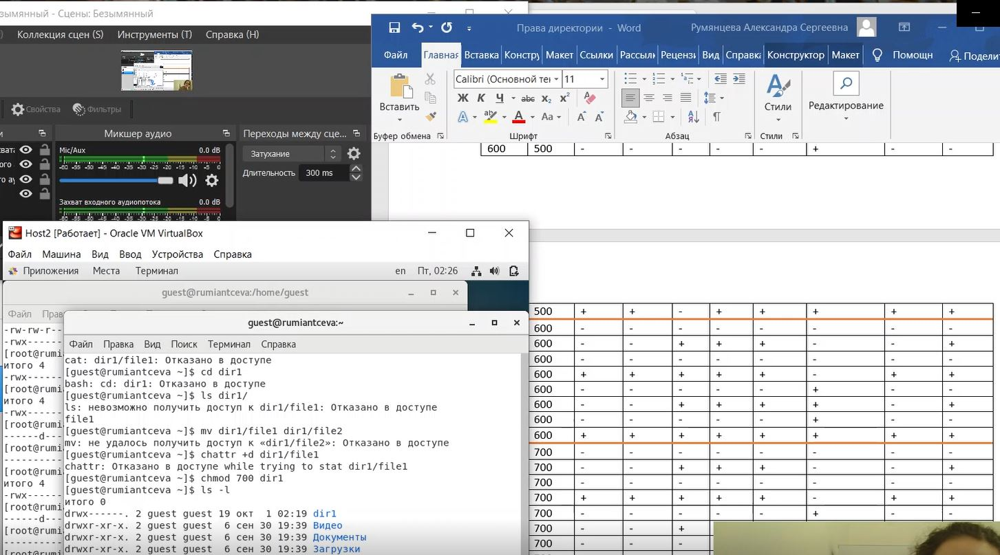{ #fig:010 width=60% }

Таким образом у нас получилась следующая таблица:

   |Правка директории|Права файла|Создание файла|Удаление файла|Запись в файл|Чтение файла|Смена директории|Просмотр файлов в директории|Переименование файла|Смена атрибутов файла|
   |:--------------- |:---------:|:------------:|:-------------|:-----------:|:----------:|:---------------|:--------------------------:|:------------------:|--------------------:|
   | d(000)          |	(000)    |      -       |      -       |      -      |      -     |        -       |              -             |          -         |         -           |
   | d(100)          |	(000)    |      -       |      -       |      -      |      -     |        +       |              -             |          -         |         -           |
   | d(200)          |	(000)    |      -       |      -       |      -      |      -     |        -       |              -             |          -         |         -           |
   | d(300)          |	(000)    |      +       |      +       |      -      |      -     |        +       |              -             |          +         |         -           |
   | d(400)          |	(000)    |      -       |      -       |      -      |      -     |        -       |              +             |          -         |         -           |
   | d(500)          |	(000)    |      -       |      -       |      -      |      -     |        +       |              +             |          -         |         -           |
   | d(600)          |	(000)    |      -       |      -       |      -      |      -     |        -       |              +             |          -         |         -           |
   | d(700)          |	(000)    |      +       |      +       |      -      |      -     |        +       |              +             |          +         |         -           |
   |                 |           |              |              |             |            |                |                            |                    |                     | 
   | d(000)          |	(100)    |      -       |      -       |      -      |      -     |        -       |              -             |          -         |         -           |
   | d(100)          |	(100)    |      -       |      -       |      -      |      -     |        +       |              -             |          -         |         -           |  
   | d(200)          |	(100)    |      -       |      -       |      -      |      -     |        -       |              -             |          -         |         -           |
   | d(300)          |	(100)    |      +       |      +       |      -      |      -     |        +       |              -             |          +         |         -           |
   | d(400)          |	(100)    |      -       |      -       |      -      |      -     |        -       |              +             |          -         |         -           |
   | d(500)          |	(100)    |      -       |      -       |      -      |      -     |        +       |              +             |          -         |         -           |
   | d(600)          |	(100)    |      -       |      -       |      -      |      -     |        -       |              +             |          -         |         -           |
   | d(700)          |	(100)    |      +       |      +       |      -      |      -     |        +       |              +             |          +         |         -           |
   |                 |           |              |              |             |            |                |                            |                    |                     |
   | d(000)          |	(200)    |      -       |      -       |      -      |      -     |        -       |              -             |          -         |         -           |
   | d(100)          |	(200)    |      -       |      -       |      +      |      -     |        +       |              -             |          -         |         -           |
   | d(200)          |	(200)    |      -       |      -       |      -      |      -     |        -       |              -             |          -         |         -           |
   | d(300)          |	(200)    |      +       |      +       |      +      |      -     |        +       |              -             |          +         |         -           |
   | d(400)          |	(200)    |      -       |      -       |      -      |      -     |        -       |              +             |          -         |         -           |
   | d(500)          |	(200)    |      -       |      -       |      +      |      -     |        +       |              +             |          -         |         -           |
   | d(600)          |	(200)    |      -       |      -       |      -      |      -     |        -       |              +             |          -         |         -           |
   | d(700)          |	(200)    |      +       |      +       |      +      |      -     |        +       |              +             |          +         |         -           |
   |                 |           |              |              |             |            |                |                            |                    |                     |
   | d(000)          |	(300)    |      -       |      -       |      -      |      -     |        -       |              -             |          -         |         -           |
   | d(100)          |	(300)    |      -       |      -       |      +      |      -     |        +       |              -             |          -         |         -           |
   | d(200)          |	(300)    |      -       |      -       |      -      |      -     |        -       |              -             |          -         |         -           |
   | d(300)          |	(300)    |      +       |      +       |      +      |      -     |        +       |              -             |          +         |         -           |
   | d(400)          |	(300)    |      -       |      -       |      -      |      -     |        -       |              +             |          -         |         -           |
   | d(500)          |	(300)    |      -       |      -       |      +      |      -     |        +       |              +             |          -         |         -           |
   | d(600)          |	(300)    |      -       |      -       |      -      |      -     |        -       |              +             |          -         |         -           |
   | d(700)          |	(300)    |      +       |      +       |      +      |      -     |        +       |              +             |          +         |         -           |
   |                 |           |              |              |             |            |                |                            |                    |                     |
   | d(000)          |	(400)    |      -       |      -       |      -      |      -     |        -       |              -             |          -         |         -           |
   | d(100)          |	(400)    |      -       |      -       |      -      |      +     |        +       |              -             |          -         |         +           |
   | d(200)          |	(400)    |      -       |      -       |      -      |      -     |        -       |              -             |          -         |         -           |
   | d(300)          |	(400)    |      +       |      +       |      -      |      +     |        +       |              -             |          +         |         +           |
   | d(400)          |	(400)    |      -       |      -       |      -      |      -     |        -       |              +             |          -         |         -           |
   | d(500)          |	(400)    |      -       |      -       |      -      |      +     |        +       |              +             |          -         |         +           |
   | d(600)          |	(400)    |      -       |      -       |      -      |      -     |        -       |              +             |          -         |         -           |
   | d(700)          |	(400)    |      +       |      +       |      -      |      +     |        +       |              +             |          +         |         +           |
   |                 |           |              |              |             |            |                |                            |                    |                     |
   | d(000)          |	(500)    |      -       |      -       |      -      |      -     |        -       |              -             |          -         |         -           |
   | d(100)          |	(500)    |      -       |      -       |      -      |      +     |        +       |              -             |          -         |         +           |
   | d(200)          |	(500)    |      -       |      -       |      -      |      -     |        -       |              -             |          -         |         -           |
   | d(300)          |	(500)    |      +       |      +       |      -      |      +     |        +       |              -             |          +         |         +           |
   | d(400)          |	(500)    |      -       |      -       |      -      |      -     |        -       |              +             |          -         |         -           |
   | d(500)          |	(500)    |      -       |      -       |      -      |      +     |        +       |              +             |          -         |         +           |
   | d(600)          |	(500)    |      -       |      -       |      -      |      -     |        -       |              +             |          -         |         -           |
   | d(700)          |	(500)    |      +       |      +       |      -      |      +     |        +       |              +             |          +         |         +           |
   |                 |           |              |              |             |            |                |                            |                    |                     |
   | d(000)          |	(600)    |      -       |      -       |      -      |      -     |        -       |              -             |          -         |         -           |
   | d(100)          |	(600)    |      -       |      -       |      +      |      +     |        +       |              -             |          -         |         +           |
   | d(200)          |	(600)    |      -       |      -       |      -      |      -     |        -       |              -             |          -         |         -           |
   | d(300)          |	(600)    |      +       |      +       |      +      |      +     |        +       |              -             |          +         |         +           |
   | d(400)          |	(600)    |      -       |      -       |      -      |      -     |        -       |              +             |          -         |         -           |
   | d(500)          |	(600)    |      -       |      -       |      +      |      +     |        +       |              +             |          -         |         +           |
   | d(600)          |	(600)    |      -       |      -       |      -      |      -     |        -       |              +             |          -         |         -           |
   | d(700)          |	(600)    |      +       |      +       |      +      |      +     |        +       |              +             |          +         |         +           |
   |                 |           |              |              |             |            |                |                            |                    |                     |
   | d(000)          |	(700)    |      -       |      -       |      -      |      -     |        -       |              -             |          -         |         -           |
   | d(100)          |	(700)    |      -       |      -       |      +      |      +     |        +       |              -             |          -         |         +           |
   | d(200)          |	(700)    |      -       |      -       |      -      |      -     |        -       |              -             |          -         |         -           |
   | d(300)          |	(700)    |      +       |      +       |      +      |      +     |        +       |              -             |          +         |         +           |
   | d(400)          |	(700)    |      -       |      -       |      -      |      -     |        -       |              +             |          -         |         -           |
   | d(500)          |	(700)    |      -       |      -       |      +      |      +     |        +       |              +             |          -         |         +           |
   | d(600)          |	(700)    |      -       |      -       |      -      |      -     |        -       |              +             |          -         |         -           |
   | d(700)          |	(700)    |      +       |      +       |      +      |      +     |        +       |              +             |          +         |         +           |

15.  На основании заполненной таблицы в пункте 14 опредяю те или иные минимально необходимые права для выполнения операций внутри директории dir1 (рис. 11).

   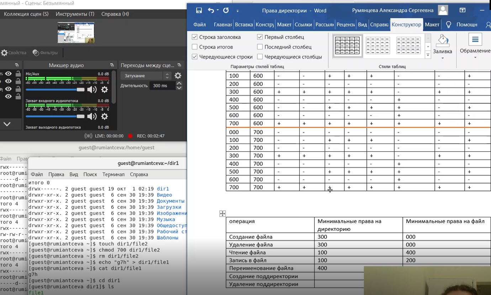{ #fig:011 width=60% }

Таким образом у нас получилась следующая таблица:

   |       Операция       |Мин. права на директорию| Мин. права на файл |
   |:-------------------- |:----------------------:| ------------------:|
   |    Создание файла    |           300          |        000         |
   |    Удаление файла    |           300          |        000         |
   |     Чтение файла     |           100          |        400         |
   |     Запись в файл    |           300          |        200         |
   | Переименование файла |           300          |        000         |
   |Создание поддиректории|           300          |         -          |
   |Удаление поддиректории|           300          |         -          |

В последнем столбце "-", так как не зависит от файла

# Библиография

1. ТУИС РУДН

2. Статья на сайте rizado.ru <https://rizado.ru/2019/03/23/prava-dostupa-k-fajlam-v-linux-ili-chto-takoe-666/#:~:text=Права%20можно%20задавать%20либо%20буквами,значения%2C%20можно%20получать%20разные%20права>

# Выводы

Я получила практические навыки работы в консоли с атрибутами файлов, закрепила теоретические основы дискреционного разграничения доступа в современных системах с открытым кодом на базе ОС Linux1.
