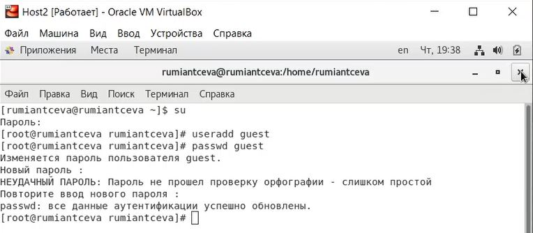

---
## Front matter
lang: ru-RU
title: Лабораторная работа №3
subtitle: 'Дискреционное разграничение прав в Linux. два пользователя'
author: 'Румянцева Александра Сергеевна'
date: 15 октября, 2021

## Formatting
toc: false
slide_level: 2
theme: metropolis
mainfont: Ubuntu
romanfont: Ubuntu
sansfont: Ubuntu
monofont: Ubuntu
header-includes: 
 - \metroset{progressbar=frametitle,sectionpage=progressbar,numbering=fraction}
 - '\makeatletter'
 - '\beamer@ignorenonframefalse'
 - '\makeatother'
aspectratio: 43
section-titles: true
---

## Цель работы

Получение практических навыков работы в консоли с атрибутами файлов для групп пользовалетей.

## Задание

Лабораторная работа подразумевает изучение установленных прав и разрешённых действий над файлами и директориями для групп пользователей опытным путем, определение минимальных прав для операций.

## Выполнение лабораторной работы

1-2. Создала учётную запись пользователя guest и задала пароль для него (рис. 1).

   { #fig:001 width=60% }

---

3-4. Аналогично создала второго пользователя guest и задала для него пароль и добавила пользователя guest2 в группу guest командой gpasswd -a guest2 guest (рис. 2)

   { #fig:002 width=60% }

---

5-7. Осуществила вход в систему от двух пользователей на двух разных консолях: guest на первой консоли и guest2 на второй консоли. Для обоих пользователей выполнила команды pwd, id, groups, id -Gn и id -G (рис. 3). Сравнила релультаты.

   { #fig:003 width=60% }

---

9. От имени пользователя guest2 выполнила регистрацию пользователя guest2 в группе guest командой newgrp guest (рис. 4)

   { #fig:005 width=60% }

---

10-11. От имени пользователя guest изменила права директории /home/guest, разрешив все действия для пользователей группы (chmod g+rwx /home/guest) и сняла с директории /home/guest/dir1 все атрибуты (chmod 000 dirl) (рис. 5).

   { #fig:006 width=60% }

---

12. Заполнила таблицу 1 опытным путём.

Команды для проверки, котрые я использовала: 
	touch - проверка на создание файла,
	rm - проверка на удаление файла,
	echo - проверка на запись в файл,
	cat - проверка на чтение файла,
	cd - проверка на доступ в директорию,
	ls - проверка на просмотр файлов в директории,
	mv - проверка на переименование файла,
	chattr - проверка добавление атрибутов.

Для смены и задания прав на файл или директорию я использовала команду chmod.

---

   { #fig:007 width=60% }

---

   { #fig:008 width=60% }

## На основании заполненной таблицы опредяю минимально необходимые права для выполнения операций внутри директории dir1.

   |       Операция       |Мин. права на директорию| Мин. права на файл |
   |:-------------------- |:----------------------:| ------------------:|
   |    Создание файла    |           030          |        000         |
   |    Удаление файла    |           030          |        000         |
   |     Чтение файла     |           010          |        040         |
   |     Запись в файл    |           010          |        020         |
   | Переименование файла |           030          |        000         |
   |Создание поддиректории|           030          |        000         |
   |Удаление поддиректории|           030          |        000         |

## Выводы

Я получила практические навыки работы в консоли с атрибутами файлов для групп пользовалетей.

