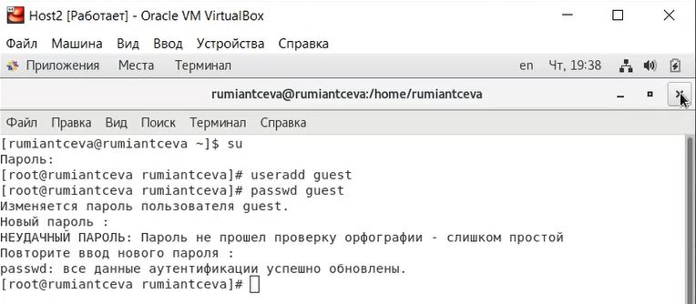
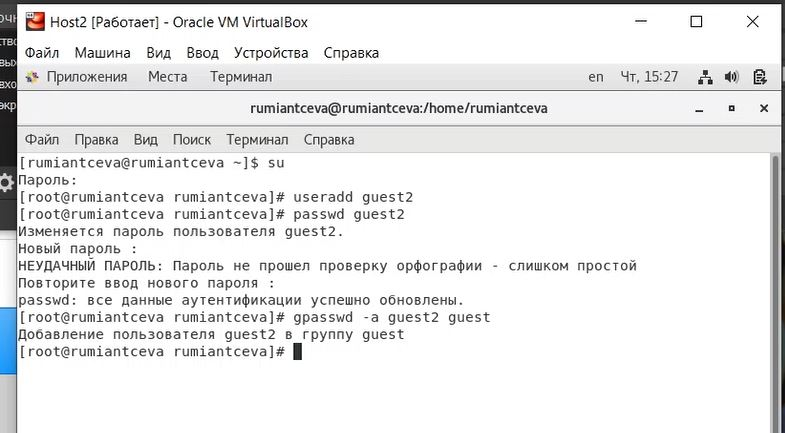
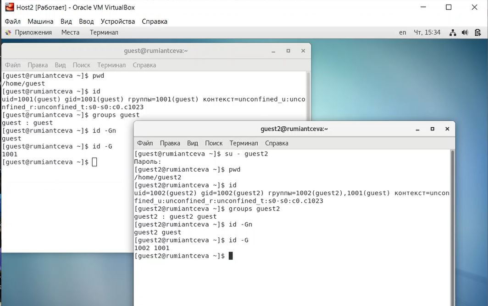
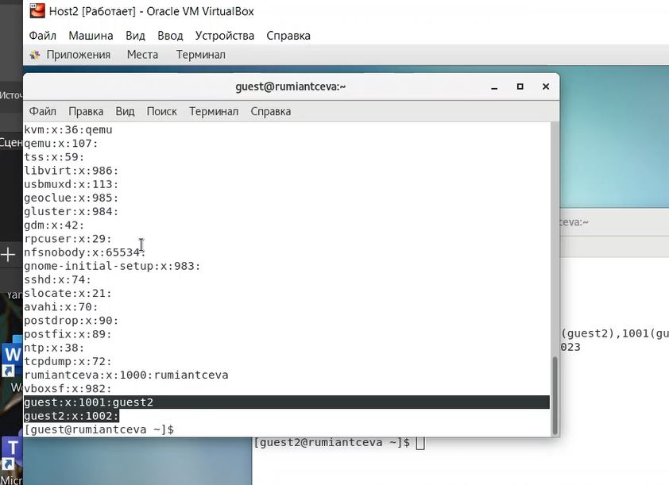
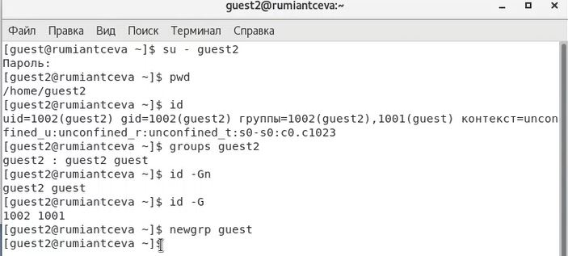
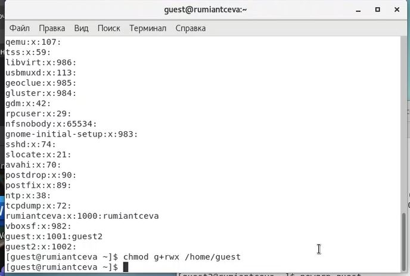
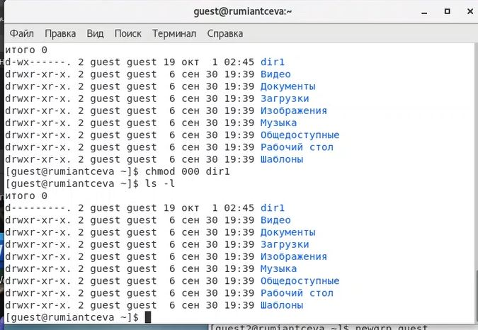
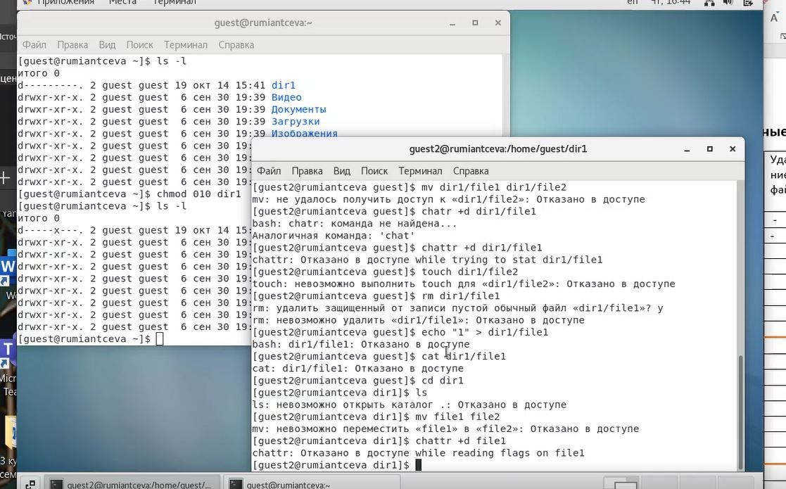
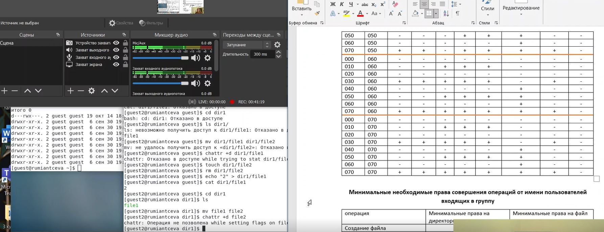
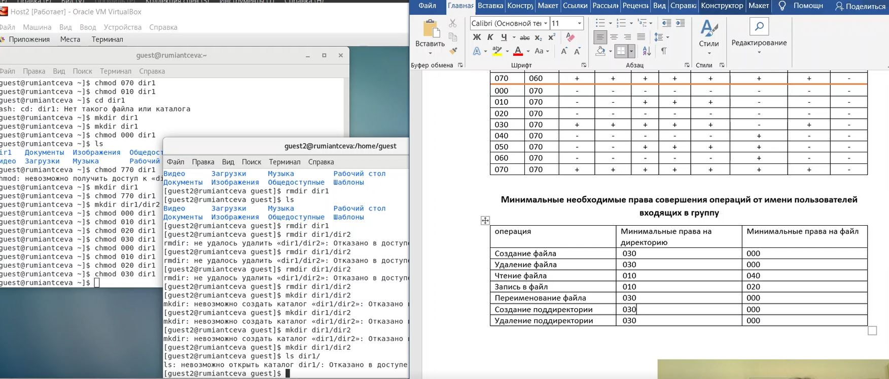

---
# Front matter
lang: ru-RU
title: 'Отчёт по лабораторной работе 3'
subtitle: 'Дискреционное разграничение прав в Linux. Два пользователя'
author: 'Румянцева Александра Сергеевна'

# Formatting
toc-title: 'Содержание'
toc: true # Table of contents
toc_depth: 2
lof: true # List of figures
lot: true # List of tables
fontsize: 12pt
linestretch: 1.5
papersize: a4paper
documentclass: scrreprt
polyglossia-lang: russian
polyglossia-otherlangs: english
mainfont: PT Serif
romanfont: PT Serif
sansfont: PT Sans
monofont: PT Mono
mainfontoptions: Ligatures=TeX
romanfontoptions: Ligatures=TeX
sansfontoptions: Ligatures=TeX,Scale=MatchLowercase
monofontoptions: Scale=MatchLowercase
indent: true
pdf-engine: lualatex
header-includes:
  - \linepenalty=10 # the penalty added to the badness of each line within a paragraph (no associated penalty node) Increasing the value makes tex try to have fewer lines in the paragraph.
  - \interlinepenalty=0 # value of the penalty (node) added after each line of a paragraph.
  - \hyphenpenalty=50 # the penalty for line breaking at an automatically inserted hyphen
  - \exhyphenpenalty=50 # the penalty for line breaking at an explicit hyphen
  - \binoppenalty=700 # the penalty for breaking a line at a binary operator
  - \relpenalty=500 # the penalty for breaking a line at a relation
  - \clubpenalty=150 # extra penalty for breaking after first line of a paragraph
  - \widowpenalty=150 # extra penalty for breaking before last line of a paragraph
  - \displaywidowpenalty=50 # extra penalty for breaking before last line before a display math
  - \brokenpenalty=100 # extra penalty for page breaking after a hyphenated line
  - \predisplaypenalty=10000 # penalty for breaking before a display
  - \postdisplaypenalty=0 # penalty for breaking after a display
  - \floatingpenalty = 20000 # penalty for splitting an insertion (can only be split footnote in standard LaTeX)
  - \raggedbottom # or \flushbottom
  - \usepackage{float} # keep figures where there are in the text
  - \floatplacement{figure}{H} # keep figures where there are in the text
---

# Цель работы

Получение практических навыков работы в консоли с атрибутами файлов для групп пользовалетей.

# Задание

Лабораторная работа подразумевает изучение установленных прав и разрешённых действий над файлами и директориями для групп пользователей опытным путем, определение минимальных прав для операций.

# Теория

Изучим, что представляют из себя права доступа в Linux.

Права доступа имеют всего 3 опции − чтение, запись и запуск на выполнение, устанавливаемые для владельца, группы и прочих пользователей (для папки запуск на выполнение означает просмотр содержимого − списка файлов и вложенных папок).

Права можно задавать либо буквами r (read), w (Write) и x (eXecute), либо в двоичной системе (точнее в восьмеричной с использованием цифр от 0 до 7, но на основе двоичной системы).

Праву на чтение (r) соответствует значение 4, записи (w) − 2 и выполнению/просмотру файлов (x) − 1. Комбинируя эти значения, можно получать разные права. Например:
	
	- 6 = (4 + 2) − чтение и запись

	- 5 = (4 + 1) − чтение и исполнение

Первыми задаются права доступа для владельца, затем для группы и в конце для всех прочих.

Обычно для документов и файлов данных устанавливаются права 644 или 664. Это означает, что владелец может читать и изменять файл (включая удаление), члены группы в первом случае только читать, а во втором изменять, а все прочие − только читать.

Для исполняемых файлов и папок обычно задаются права 755 или 775. Значения те же, что и в предыдущем абзаце плюс присутствует право на выполнение или просмотр списка вложенных объектов.

Если задавать права доступа буквами, то указываются нужные права в виде rwx, а то, что нужно пропустить, заменяется дефисом. То есть, 644 соответствует rw-r--r--, а 755 − rwxr-xr-x.

# Выполнение лабораторной работы

1. В установленной при выполнении предыдущей лабораторной работы операционной системе создала учётную запись пользователя guest с помощью команды useradd guest ещё во 2 лабораторной (рис. 1).

2. Задала пароль для пользователя guest командой passwd guest ещё во второй лабораторной (рис. 1).

   { #fig:001 width=60% }

3. Аналогично создала второго пользователя guest и задала для него пароль (рис. 2).

4. Добавила пользователя guest2 в группу guest командой gpasswd -a guest2 guest (рис. 2).

   { #fig:002 width=60% }

5. Осуществила вход в систему от двух пользователей на двух разных консолях: guest на первой консоли и guest2 на второй консоли (рис. 3)

6. Для обоих пользователей командой pwd определила директорию, в котрой вы находитесь (рис. 3).

Сравнила полученную информацию об именах пользователей с данными, выводимыми в приглашениях командных строк. Имя пользователя во всех командах выводится как guest / guest2, что совпадает с именем в приглашениях командных строк.(рис. 3).

7. Уточните имя пользователей, их группы, кто входит в них и к каким группам принадлежат они сами с помощью команды id для обоих пользователей (рис. 3).

Для пользователя guest: имя пользователя guest, uid = 1001, его группа guest, gid = 1001, он входит только в группу 1001 (guest), то есть только в свою группу.

Для пользователя guest2: имя пользователя guest2, uid = 1002, его группа guest2, gid = 1002, он входит в группы 1001 (guest) и 1002 (guest2), то есть в свою группу и группу guest.

Определила командами groups guest и groups guest2, в какие группы входят пользователи guest и guest2 (рис. 3). Вижу аналогичные результаты: guest входит только в группу guest, а guest2 в группы guest, guest2.

Сравнила вывод команды groups с выводом команд id -Gn и id -G: релультаты аналогичны: guest входит только в группу guest (1001), а guest2 в группы guest (1001), guest2 (1002). Видим, что id -Gn выводин названия групп, куда входит пользователь, а id -G индексы этих групп.

   { #fig:003 width=60% }

8. Сравнила полученную информацию с содержимым файла /etc/group, просмотрела  файл командой cat /etc/group (рис. 4)

Видим, что в группе guest есть пользователи guest и guest2, а в группе gues2 есть только пользователь guest2.

   { #fig:004 width=60% }

9. От имени пользователя guest2 выполнила регистрацию пользователя guest2 в группе guest командой newgrp guest (рис. 5)

   { #fig:005 width=60% }

10. От имени пользователя guest изменила права директории /home/guest, разрешив все действия для пользователей группы командой chmod g+rwx /home/guest (рис. 6).

   { #fig:006 width=60% }

11. От имени пользователя guest сняла с директории /home/guest/dir1 все атрибуты командой chmod 000 dirl и проверила правильность снятия атрибутов (рис. 7).

   { #fig:007 width=60% }

12. Заполнила таблицу 1 опытным путём, меняя атрибуты у директории dir1 и файла file1 от имени пользователя guest и делая проверку от пользователя guest2. 

Команды для проверки, котрые я использовала:

	- touch - проверка на создание файла

	- rm - проверка на удаление файла

	- echo - проверка на запись в файл

	- cat - проверка на чтение файла

	- cd - проверка на доступ в директорию

	- ls - проверка на просмотр файлов в директории

	- mv - проверка на переименование файла

	- chattr - проверка добавление атрибутов

Для смены и задания прав на файл или директорию я использовала команду chmod. Пример выполнения одного из 64 случаев на рисунке 8 для случая 010 / 000. Таким образом заполнялась вся таблица (рис. 9).

   { #fig:008 width=60% }

   { #fig:009 width=60% }

Таким образом у нас получилась следующая таблица:

   |Правка директории|Права файла|Создание файла|Удаление файла|Запись в файл|Чтение файла|Смена директории|Просмотр файлов в директории|Переименование файла|Смена атрибутов файла|
   |:--------------- |:---------:|:------------:|:-------------|:-----------:|:----------:|:---------------|:--------------------------:|:------------------:|--------------------:|
   | d(000)          |	(000)    |      -       |      -       |      -      |      -     |        -       |              -             |          -         |         -           |
   | d(010)          |	(000)    |      -       |      -       |      -      |      -     |        +       |              -             |          -         |         -           |
   | d(020)          |	(000)    |      -       |      -       |      -      |      -     |        -       |              -             |          -         |         -           |
   | d(030)          |	(000)    |      +       |      +       |      -      |      -     |        +       |              -             |          +         |         -           |
   | d(040)          |	(000)    |      -       |      -       |      -      |      -     |        -       |              +             |          -         |         -           |
   | d(050)          |	(000)    |      -       |      -       |      -      |      -     |        +       |              +             |          -         |         -           |
   | d(060)          |	(000)    |      -       |      -       |      -      |      -     |        -       |              +             |          -         |         -           |
   | d(070)          |	(000)    |      +       |      +       |      -      |      -     |        +       |              +             |          +         |         -           |
   |                 |           |              |              |             |            |                |                            |                    |                     | 
   | d(000)          |	(010)    |      -       |      -       |      -      |      -     |        -       |              -             |          -         |         -           |
   | d(010)          |	(010)    |      -       |      -       |      -      |      -     |        +       |              -             |          -         |         -           |  
   | d(020)          |	(010)    |      -       |      -       |      -      |      -     |        -       |              -             |          -         |         -           |
   | d(030)          |	(010)    |      +       |      +       |      -      |      -     |        +       |              -             |          +         |         -           |
   | d(040)          |	(010)    |      -       |      -       |      -      |      -     |        -       |              +             |          -         |         -           |
   | d(050)          |	(010)    |      -       |      -       |      -      |      -     |        +       |              +             |          -         |         -           |
   | d(060)          |	(010)    |      -       |      -       |      -      |      -     |        -       |              +             |          -         |         -           |
   | d(070)          |	(010)    |      +       |      +       |      -      |      -     |        +       |              +             |          +         |         -           |
   |                 |           |              |              |             |            |                |                            |                    |                     |
   | d(000)          |	(020)    |      -       |      -       |      -      |      -     |        -       |              -             |          -         |         -           |
   | d(010)          |	(020)    |      -       |      -       |      +      |      -     |        +       |              -             |          -         |         -           |
   | d(020)          |	(020)    |      -       |      -       |      -      |      -     |        -       |              -             |          -         |         -           |
   | d(030)          |	(020)    |      +       |      +       |      +      |      -     |        +       |              -             |          +         |         -           |
   | d(040)          |	(020)    |      -       |      -       |      -      |      -     |        -       |              +             |          -         |         -           |
   | d(050)          |	(020)    |      -       |      -       |      +      |      -     |        +       |              +             |          -         |         -           |
   | d(060)          |	(020)    |      -       |      -       |      -      |      -     |        -       |              +             |          -         |         -           |
   | d(070)          |	(020)    |      +       |      +       |      +      |      -     |        +       |              +             |          +         |         -           |
   |                 |           |              |              |             |            |                |                            |                    |                     |
   | d(000)          |	(030)    |      -       |      -       |      -      |      -     |        -       |              -             |          -         |         -           |
   | d(010)          |	(030)    |      -       |      -       |      +      |      -     |        +       |              -             |          -         |         -           |
   | d(020)          |	(030)    |      -       |      -       |      -      |      -     |        -       |              -             |          -         |         -           |
   | d(030)          |	(030)    |      +       |      +       |      +      |      -     |        +       |              -             |          +         |         -           |
   | d(040)          |	(030)    |      -       |      -       |      -      |      -     |        -       |              +             |          -         |         -           |
   | d(050)          |	(030)    |      -       |      -       |      +      |      -     |        +       |              +             |          -         |         -           |
   | d(060)          |	(030)    |      -       |      -       |      -      |      -     |        -       |              +             |          -         |         -           |
   | d(070)          |	(030)    |      +       |      +       |      +      |      -     |        +       |              +             |          +         |         -           |
   |                 |           |              |              |             |            |                |                            |                    |                     |
   | d(000)          |	(040)    |      -       |      -       |      -      |      -     |        -       |              -             |          -         |         -           |
   | d(010)          |	(040)    |      -       |      -       |      -      |      +     |        +       |              -             |          -         |         -           |
   | d(020)          |	(040)    |      -       |      -       |      -      |      -     |        -       |              -             |          -         |         -           |
   | d(030)          |	(040)    |      +       |      +       |      -      |      +     |        +       |              -             |          +         |         -           |
   | d(040)          |	(040)    |      -       |      -       |      -      |      -     |        -       |              +             |          -         |         -           |
   | d(050)          |	(040)    |      -       |      -       |      -      |      +     |        +       |              +             |          -         |         -           |
   | d(060)          |	(040)    |      -       |      -       |      -      |      -     |        -       |              +             |          -         |         -           |
   | d(070)          |	(040)    |      +       |      +       |      -      |      +     |        +       |              +             |          +         |         -           |
   |                 |           |              |              |             |            |                |                            |                    |                     |
   | d(000)          |	(050)    |      -       |      -       |      -      |      -     |        -       |              -             |          -         |         -           |
   | d(010)          |	(050)    |      -       |      -       |      -      |      +     |        +       |              -             |          -         |         -           |
   | d(020)          |	(050)    |      -       |      -       |      -      |      -     |        -       |              -             |          -         |         -           |
   | d(030)          |	(050)    |      +       |      +       |      -      |      +     |        +       |              -             |          +         |         -           |
   | d(040)          |	(050)    |      -       |      -       |      -      |      -     |        -       |              +             |          -         |         -           |
   | d(050)          |	(050)    |      -       |      -       |      -      |      +     |        +       |              +             |          -         |         -           |
   | d(060)          |	(050)    |      -       |      -       |      -      |      -     |        -       |              +             |          -         |         -           |
   | d(070)          |	(050)    |      +       |      +       |      -      |      +     |        +       |              +             |          +         |         -           |
   |                 |           |              |              |             |            |                |                            |                    |                     |
   | d(000)          |	(060)    |      -       |      -       |      -      |      -     |        -       |              -             |          -         |         -           |
   | d(010)          |	(060)    |      -       |      -       |      +      |      +     |        +       |              -             |          -         |         -           |
   | d(020)          |	(060)    |      -       |      -       |      -      |      -     |        -       |              -             |          -         |         -           |
   | d(030)          |	(060)    |      +       |      +       |      +      |      +     |        +       |              -             |          +         |         -           |
   | d(040)          |	(060)    |      -       |      -       |      -      |      -     |        -       |              +             |          -         |         -           |
   | d(050)          |	(060)    |      -       |      -       |      +      |      +     |        +       |              +             |          -         |         -           |
   | d(060)          |	(060)    |      -       |      -       |      -      |      -     |        -       |              +             |          -         |         -           |
   | d(070)          |	(060)    |      +       |      +       |      +      |      +     |        +       |              +             |          +         |         -           |
   |                 |           |              |              |             |            |                |                            |                    |                     |
   | d(000)          |	(070)    |      -       |      -       |      -      |      -     |        -       |              -             |          -         |         -           |
   | d(010)          |	(070)    |      -       |      -       |      +      |      +     |        +       |              -             |          -         |         -           |
   | d(020)          |	(070)    |      -       |      -       |      -      |      -     |        -       |              -             |          -         |         -           |
   | d(030)          |	(070)    |      +       |      +       |      +      |      +     |        +       |              -             |          +         |         -           |
   | d(040)          |	(070)    |      -       |      -       |      -      |      -     |        -       |              +             |          -         |         -           |
   | d(050)          |	(070)    |      -       |      -       |      +      |      +     |        +       |              +             |          -         |         -           |
   | d(060)          |	(070)    |      -       |      -       |      -      |      -     |        -       |              +             |          -         |         -           |
   | d(070)          |	(070)    |      +       |      +       |      +      |      +     |        +       |              +             |          +         |         -           |

Можно заметить, что таблица очень похожа на 1 таблицу из лабораторной 2, единственное различие - нигде нет доступа для смены атрибутов файла, значит это может делать только пользователь-владелец.

13.  На основании заполненной таблицы в пункте 12 опредяю те или иные минимально необходимые права для выполнения операций внутри директории dir1 от имени пользователей входящих в группу (рис. 10).

   { #fig:010 width=60% }

Таким образом у нас получилась следующая таблица:

   |       Операция       |Мин. права на директорию| Мин. права на файл |
   |:-------------------- |:----------------------:| ------------------:|
   |    Создание файла    |           030          |        000         |
   |    Удаление файла    |           030          |        000         |
   |     Чтение файла     |           010          |        040         |
   |     Запись в файл    |           010          |        020         |
   | Переименование файла |           030          |        000         |
   |Создание поддиректории|           030          |         -          |
   |Удаление поддиректории|           030          |         -          |

В последнем столбце "-", так как не зависит от файла

# Библиография

1. ТУИС РУДН

2. Статья на сайте rizado.ru <https://rizado.ru/2019/03/23/prava-dostupa-k-fajlam-v-linux-ili-chto-takoe-666/#:~:text=Права%20можно%20задавать%20либо%20буквами,значения%2C%20можно%20получать%20разные%20права>

# Выводы

Я получила практические навыки работы в консоли с атрибутами файлов для групп пользовалетей.
