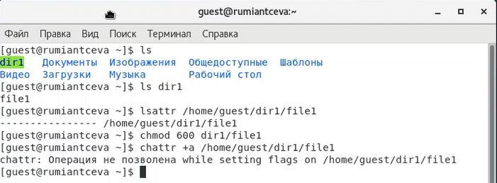
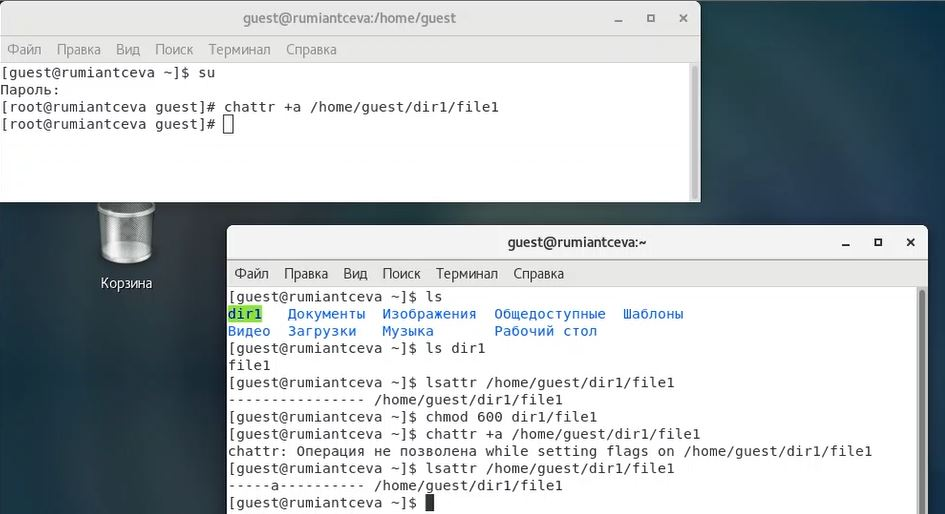
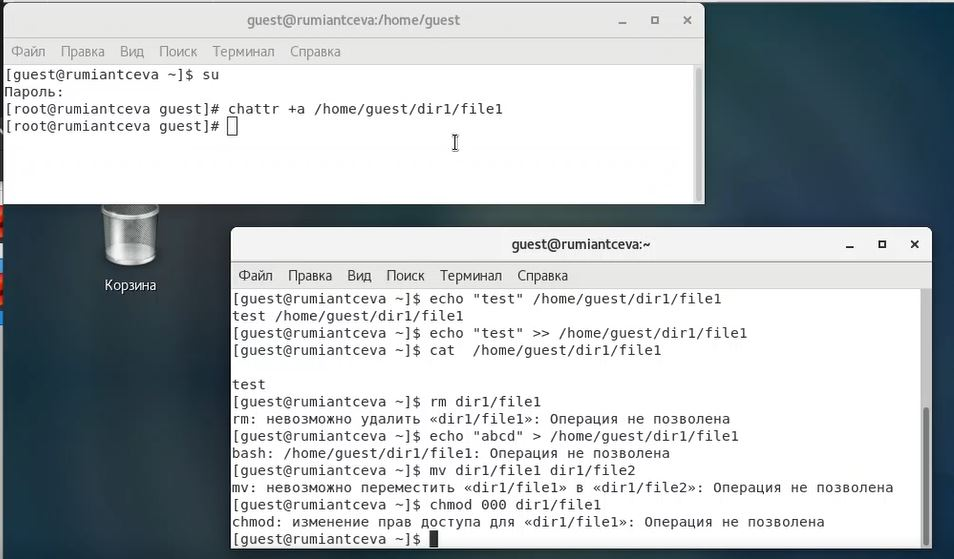
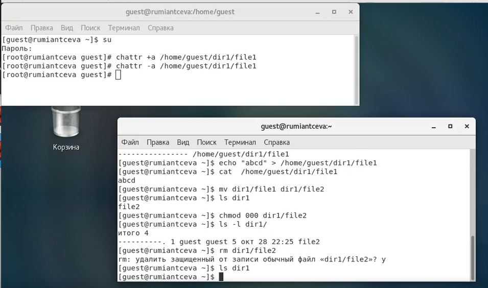
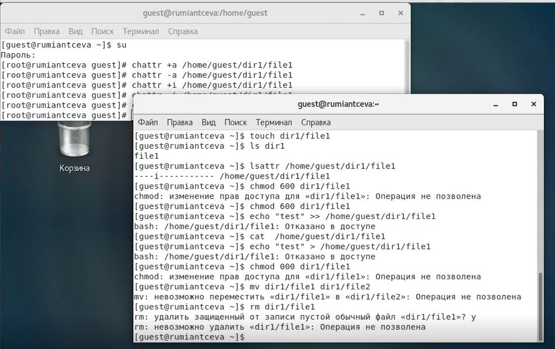

---
## Front matter
lang: ru-RU
title: Лабораторная работа №4
subtitle: 'Дискреционное разграничение прав в Linux. Расширенные атрибуты'
author: 'Румянцева Александра Сергеевна'
date: 29 октября, 2021

## Formatting
toc: false
slide_level: 2
theme: metropolis
mainfont: Ubuntu
romanfont: Ubuntu
sansfont: Ubuntu
monofont: Ubuntu
header-includes: 
 - \metroset{progressbar=frametitle,sectionpage=progressbar,numbering=fraction}
 - '\makeatletter'
 - '\beamer@ignorenonframefalse'
 - '\makeatother'
aspectratio: 43
section-titles: true
---

## Цель работы

Получение практических навыков работы в консоли с расширенными атрибутами файлов.

## Задание

Лабораторная работа подразумевает изучение влияния расширенных атрибутов на файлы пользователя.

## Выполнение лабораторной работы

1 - 3. От имени пользователя guest определила расширенные атрибуты файла /home/guest/dir1/file1, установила права на файл 600. Попробовала установить на файл расширеннный атрибут a от имени пользователя guest (рис. 1).

   { #fig:001 width=60% }

---

4-5. Установила расширенный атрибут a на файл /home/guest/dir1/file1 от имени суперпользователя, от пользователя guest проверила правильность установления атрибута (рис. 2).

   { #fig:002 width=60% }

---

6-8. Выполнила дозапись в файл file1 слова «test». Убедилась, что слово test успешно записано в файл file1.

Попробовала удалить файл file1 (rm), стереть имеющуюся в нём информацию, переименовать файл (клманда mv). Попробовала изменить права на файл file1 (chmod) (рис. 3).

   { #fig:003 width=60% }

---

9. Убрала расширенный атрибут a с файла /home/guest/dirl/file1 от имени суперпользователя командой chattr -a /home/guest/dir1/file1 и повторила операции, которые ранее не удавалось выполнить (рис. 4).

   { #fig:004 width=60% }

---

10. Повторила действия по шагам, заменив атрибут «a» атрибутом «i» (рис. 5).

   { #fig:005 width=60% }

## Результаты

На практике увидели, как влияют на файл атрибуты "a" и "i".

Убедились, что файл с атрибутом а можно только открыть только в режиме добавления для записи. Именно поэтому у нас не получилось выполнить с файлом, где есть атрибут а, такие действия как: запись с изменением уже имеющийся информации в файл, переименование, изменение прав, удаление файла.

Убедились, что файл с атрибутом «i» не может быть изменён, то есть в отличаи от атрибута а в файл нельзя даже дозаписать информацию.

## Выводы

Я получила практические навыки работы в консоли с расширенными атрибутами файлов.