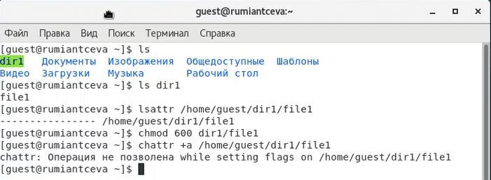
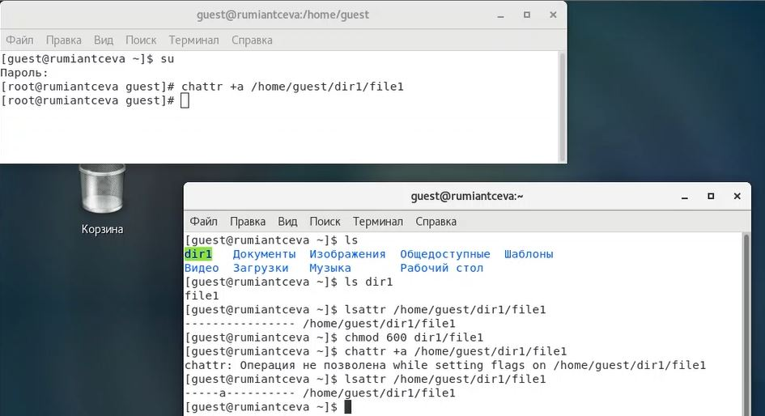
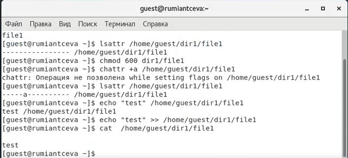
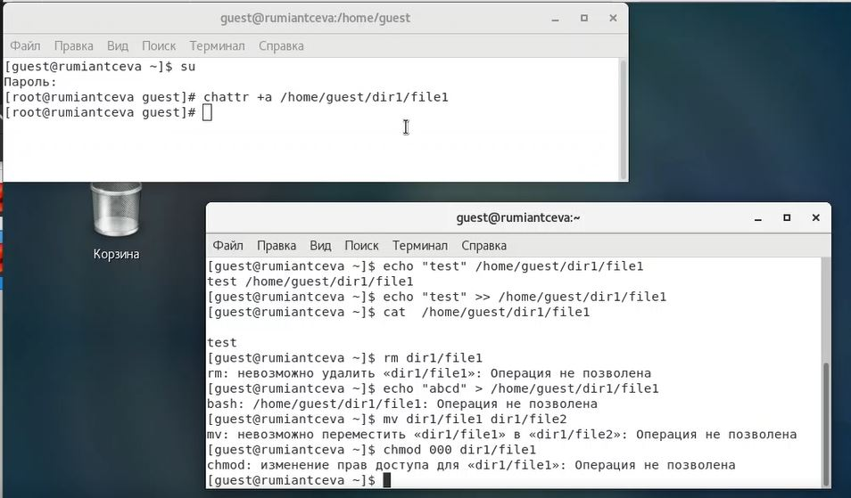
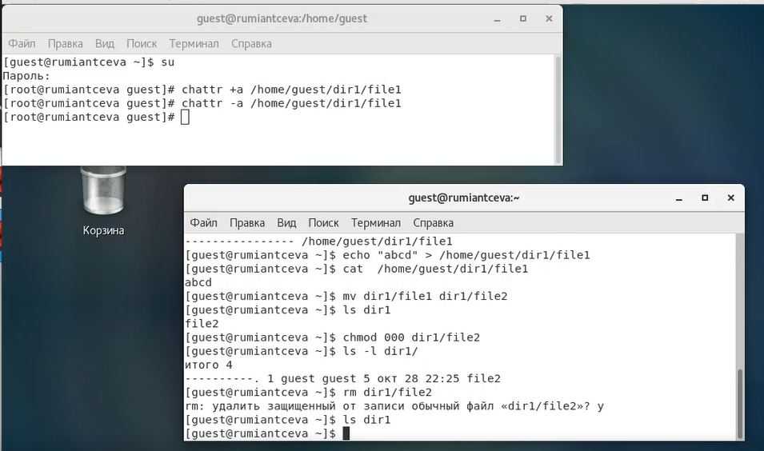
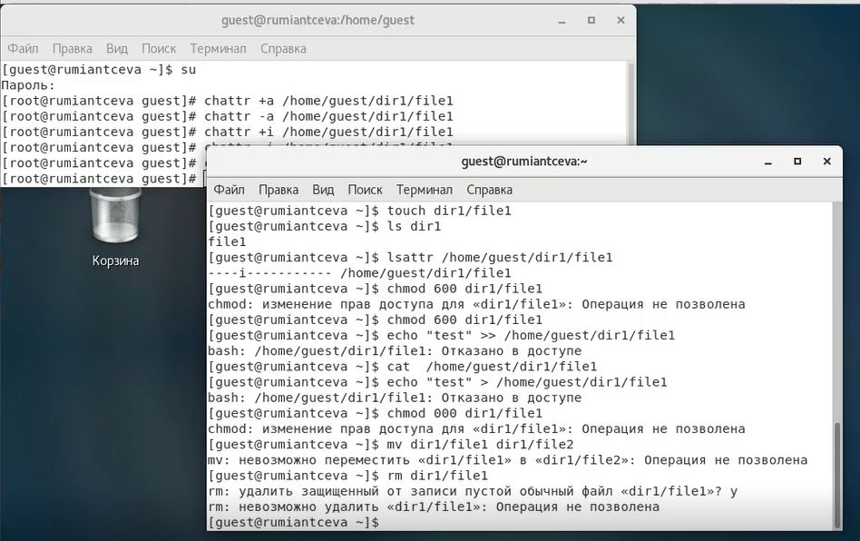

---
# Front matter
lang: ru-RU
title: 'Отчёт по лабораторной работе 4'
subtitle: 'Дискреционное разграничение прав в Linux. Расширенные атрибуты'
author: 'Румянцева Александра Сергеевна'

# Formatting
toc-title: 'Содержание'
toc: true # Table of contents
toc_depth: 2
lof: true # List of figures
lot: true # List of tables
fontsize: 12pt
linestretch: 1.5
papersize: a4paper
documentclass: scrreprt
polyglossia-lang: russian
polyglossia-otherlangs: english
mainfont: PT Serif
romanfont: PT Serif
sansfont: PT Sans
monofont: PT Mono
mainfontoptions: Ligatures=TeX
romanfontoptions: Ligatures=TeX
sansfontoptions: Ligatures=TeX,Scale=MatchLowercase
monofontoptions: Scale=MatchLowercase
indent: true
pdf-engine: lualatex
header-includes:
  - \linepenalty=10 # the penalty added to the badness of each line within a paragraph (no associated penalty node) Increasing the value makes tex try to have fewer lines in the paragraph.
  - \interlinepenalty=0 # value of the penalty (node) added after each line of a paragraph.
  - \hyphenpenalty=50 # the penalty for line breaking at an automatically inserted hyphen
  - \exhyphenpenalty=50 # the penalty for line breaking at an explicit hyphen
  - \binoppenalty=700 # the penalty for breaking a line at a binary operator
  - \relpenalty=500 # the penalty for breaking a line at a relation
  - \clubpenalty=150 # extra penalty for breaking after first line of a paragraph
  - \widowpenalty=150 # extra penalty for breaking before last line of a paragraph
  - \displaywidowpenalty=50 # extra penalty for breaking before last line before a display math
  - \brokenpenalty=100 # extra penalty for page breaking after a hyphenated line
  - \predisplaypenalty=10000 # penalty for breaking before a display
  - \postdisplaypenalty=0 # penalty for breaking after a display
  - \floatingpenalty = 20000 # penalty for splitting an insertion (can only be split footnote in standard LaTeX)
  - \raggedbottom # or \flushbottom
  - \usepackage{float} # keep figures where there are in the text
  - \floatplacement{figure}{H} # keep figures where there are in the text
---

# Цель работы

Получение практических навыков работы в консоли с расширенными атрибутами файлов.

# Задание

Лабораторная работа подразумевает изучение влияния расширенных атрибутов на файлы пользователя.

# Теория

Изучим, что представляют из себя права доступа в Linux.

Права доступа имеют всего 3 опции − чтение, запись и запуск на выполнение, устанавливаемые для владельца, группы и прочих пользователей (для папки запуск на выполнение означает просмотр содержимого − списка файлов и вложенных папок).

Права можно задавать либо буквами r (read), w (Write) и x (eXecute), либо в двоичной системе (точнее в восьмеричной с использованием цифр от 0 до 7, но на основе двоичной системы).

Праву на чтение (r) соответствует значение 4, записи (w) − 2 и выполнению/просмотру файлов (x) − 1. Комбинируя эти значения, можно получать разные права. Например:
	
	- 6 = (4 + 2) − чтение и запись

	- 5 = (4 + 1) − чтение и исполнение

Первыми задаются права доступа для владельца, затем для группы и в конце для всех прочих.

Обычно для документов и файлов данных устанавливаются права 644 или 664. Это означает, что владелец может читать и изменять файл (включая удаление), члены группы в первом случае только читать, а во втором изменять, а все прочие − только читать.

Для исполняемых файлов и папок обычно задаются права 755 или 775. Значения те же, что и в предыдущем абзаце плюс присутствует право на выполнение или просмотр списка вложенных объектов.

Если задавать права доступа буквами, то указываются нужные права в виде rwx, а то, что нужно пропустить, заменяется дефисом. То есть, 644 соответствует rw-r--r--, а 755 − rwxr-xr-x.

Изучим, что такое расширенные атрибуты и какие они бывают.

Файловые атрибуты могут использовать администраторы и пользователи для защиты файлов от случайных удалений и изменений, а также их применяют злоумышленники, делая невозможным удаление вредоносного файла.

Рассмотрим некоторые виды атрибутов:

a - Файл с установленным атрибутом «a» можно открыть только в режиме добавления для записи. Только суперпользователь или процесс, обладающий возможностью CAP_LINUX_IMMUTABLE, может установить или очистить этот атрибут.

c - Файл с установленным атрибутом «c» автоматически сжимается на диске ядром. При чтении из этого файла возвращаются несжатые данные. Запись в этот файл сжимает данные перед их сохранением на диске. Примечание: обязательно прочтите об ошибках и ограничениях в конце этого раздела. (Примечание: для btrfs: если установлен флаг «c», то нельзя установить флаг «C». Также конфликтует с параметром монтирования btrfs «nodatasum»)

C - Файл с установленным атрибутом «C» не подлежит обновлению «копирование при записи». Этот флаг поддерживается только в файловых системах, которые выполняют копирование при записи. (Примечание: для btrfs флаг «C» должен быть установлен для новых или пустых файлов. Если он установлен для файла, который уже имеет блоки данных, он не определён, когда блоки, назначенные файлу, будут полностью стабильными. Если для каталога установлен флаг «C», он не повлияет на каталог, но для новых файлов, созданных в этом каталоге, будет установлен атрибут No_COW. Если установлен флаг «C», то флаг «c» не может быть установлен. установленный.)

d - Файл с установленным атрибутом «d» не является кандидатом для резервного копирования при запуске программы dump.

e - Атрибут «e» указывает, что файл использует экстенты для отображения блоков на диске. Его нельзя удалить с помощью chattr.

E - Файл, каталог или символическая ссылка с установленным атрибутом «E» зашифрованы файловой системой. Этот атрибут нельзя установить или сбросить с помощью chattr, хотя он может быть отображён с помощью lsattr.

i - Файл с атрибутом «i» не может быть изменён: его нельзя удалить или переименовать, нельзя создать ссылку на этот файл, большую часть метаданных файла нельзя изменить, и файл нельзя открыть в режиме записи. Только суперпользователь или процесс, обладающий возможностью CAP_LINUX_IMMUTABLE, может установить или очистить этот атрибут.

m - Файл с атрибутом «m» исключается из сжатия в файловых системах, которые поддерживают сжатие файлов.

P - Директория с установленным атрибутом «P» будет обеспечивать иерархическую структуру для идентификаторов проектов. Это означает, что файлы и каталоги, созданные в директории, будут наследовать идентификатор проекта каталога, операции переименования ограничены, поэтому, когда файл или каталог перемещается в другой каталог, идентификаторы проекта должны совпадать. Кроме того, жёсткая ссылка на файл может быть создана только в том случае, если идентификатор проекта для файла и целевой каталог совпадают.

s - Когда файл с установленным атрибутом «s» удаляется, его блоки обнуляются и записываются обратно на диск. Примечание: обязательно прочтите об ошибках и ограничениях в конце этого раздела.

S - При изменении файла с установленным атрибутом «S» изменения синхронно записываются на диск; это эквивалентно опции монтирования «sync», применяемой к подмножеству файлов.

u - Когда файл с установленным атрибутом «u» удаляется, его содержимое сохраняется. Это позволяет пользователю запрашивать его восстановление. Примечание: обязательно прочтите об ошибках и ограничениях в конце этого раздел.

x - Атрибут «x» может быть установлен для каталога или файла. Если атрибут установлен в существующем каталоге, он будет унаследован всеми файлами и подкаталогами, которые впоследствии будут созданы в каталоге. Если существующий каталог содержал некоторые файлы и подкаталоги, изменение атрибута в родительском каталоге не изменяет атрибуты этих файлов и подкаталогов.

V - Для файла с установленным атрибутом «V» включена функция проверки подлинности. Он не может быть записан, и файловая система будет автоматически проверять все данные, считанные из неё, по криптографическому хешу, который покрывает всё содержимое файла, например через дерево Меркла. Это позволяет эффективно аутентифицировать файл. Этот атрибут нельзя установить или сбросить с помощью chattr, хотя он может быть отображён с помощью lsattr.

Команда chattr изменяет атрибуты файлов в файловой системе Linux.

Формат символьного режима: +-[acdDe].

Оператор «+» вызывает добавление выбранных атрибутов к существующим атрибутам файлов; «-» заставляет их удалить; и «=» делает их единственными атрибутами файлов.

Буквы в [] выбирают новые атрибуты для файлов: только добавление (a), без обновлений времени (A), сжатие (c), без копирования при записи (C), без дампа (d), синхронные обновления каталогов (D), формат экстента (e), поиск в каталогах без учёта регистра (F), неизменяемый (i), ведение журнала данных (j), без сжатия (m), иерархия проекта (P), безопасное удаление (s), синхронные обновления (S), без слияния хвостов (t), вершина иерархии каталогов (T), возможнсть восстановления после удаления (u) и прямой доступ к файлам (x).

Командой lsattr можно посмотреть какие атрибуты установлены на файл. 

# Выполнение лабораторной работы

1. От имени пользователя guest определила расширенные атрибуты файла /home/guest/dir1/file1 командой lsattr /home/guest/dir1/file1 (рис. 1). Видим, что на файле нет никаких расширенных атрибутов, так как везде стоят "-".

2. Установила командой chmod 600 file1 на файл file1 права, разрешающие чтение и запись для владельца файла. (рис. 1).

3. Попробовала установить на файл /home/guest/dir1/file1 расширеннный атрибут a от имени пользователя guest командой chattr +a /home/guest/dir1/file1 (рис. 1). Получила отказ на выполнение команды. 

   { #fig:001 width=60% }

4. Зашла на вторую консоль, где зашла под root пользователя командой su. Попробовала установить расширенный атрибут a на файл /home/guest/dir1/file1 от имени суперпользователя командой chattr +a /home/guest/dir1/file1 (рис. 2).

5. От пользователя guest проверила правильность установления атрибута командой lsattr /home/guest/dir1/file1 (рис. 2). Видим, что атрибут был установлен.

   { #fig:002 width=60% }

6. Выполнила дозапись в файл file1 слова «test» командой echo "test" >> /home/guest/dir1/file1 (рис. 3). (в задании была указана команда echo "test" /home/guest/dir1/file1, но, как мы видим из результата выполнения, она используется некорректно.)

После этого выполнила чтение файла file1 командой cat /home/guest/dir1/file1 (рис. 3). Убедилась, что слово test успешно записано в файл file1.

   { #fig:003 width=60% }

7. Попробовала удалить файл file1 (rm), стереть имеющуюся в нём информацию командой echo "abcd" > /home/guest/dirl/file1, попробовала переименовать файл (клманда mv) (рис. 4).

8. Попробовала с помощью команды chmod 000 file1 установить на файл file1 права запрещающие чтение и запись для владельца файла (рис. 4).

   { #fig:004 width=60% }

Видим, что не удается успешно выполнить указанные в 7 и 8 пунктах команды.

9. Убрала расширенный атрибут a с файла /home/guest/dirl/file1 от имени суперпользователя командой chattr -a /home/guest/dir1/file1 и повторила операции, которые ранее не удавалось выполнить (удаление файла, запись (с изменением имующихся данных) в файл, переименование файла, изменение прав файла). Все эти команды удалось выполнить. (рис. 5)

   { #fig:005 width=60% }

Какие выводы мы можем сделать:

Как мы и узнали в теории, файл с атрибутом а можно только открыть только в режиме добавления для записи. Именно поэтому у нас не получилось выполнить с файлом, где есть атрибут а, такие действия как: запись с изменением уже имеющийся информации в файл, переименование, изменение прав на файл, удаление файла. Но мы сумели выполнить дозапись ф файл и могли прочитать его (в том числе так как права на файл установлены 600).  

10. Повторила действия по шагам, заменив атрибут «a» атрибутом «i» (рис. 6).

   { #fig:006 width=60% }

Как мы можем увидеть по рисунку 6, для файла с атрибутом i мы не смогли выполнить никаких действий, в том числе и дозапись (в отличаи от атрибута а). Мы смогли только прочитать информацию из файла (в том числе, так как установлены права на файл 600).

# Библиография

1. ТУИС РУДН

2. Статья на сайте rizado.ru <https://rizado.ru/2019/03/23/prava-dostupa-k-fajlam-v-linux-ili-chto-takoe-666/#:~:text=Права%20можно%20задавать%20либо%20буквами,значения%2C%20можно%20получать%20разные%20права>

3. Статья "Атрибуты файлов в Linux" на сайте zalinux.ru <https://zalinux.ru/?p=6440> 

# Выводы

Я получила практические навыки работы в консоли с расширенными атрибутами файлов.