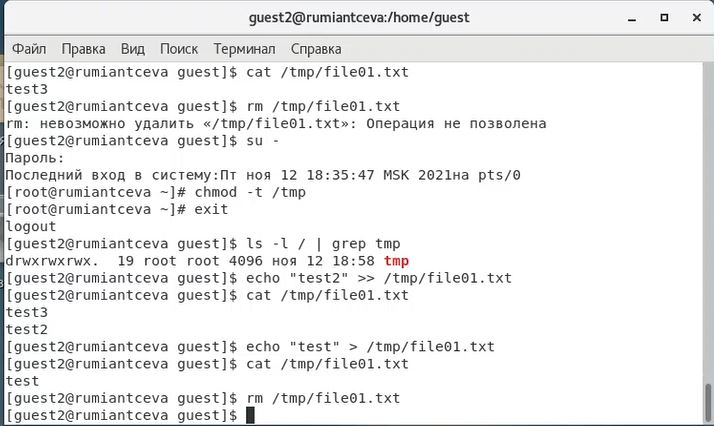

---
## Front matter
lang: ru-RU
title: Лабораторная работа №5
subtitle: 'Дискреционное разграничение прав в Linux. Исследование влияния дополнительных атрибутов'
author: 'Румянцева Александра Сергеевна'
date: 12 ноября, 2021

## Formatting
toc: false
slide_level: 2
theme: metropolis
mainfont: Ubuntu
romanfont: Ubuntu
sansfont: Ubuntu
monofont: Ubuntu
header-includes: 
 - \metroset{progressbar=frametitle,sectionpage=progressbar,numbering=fraction}
 - '\makeatletter'
 - '\beamer@ignorenonframefalse'
 - '\makeatother'
aspectratio: 43
section-titles: true
---

## Цели и задание на лабораторную работу

Цель: Изучение механизмов изменения идентификаторов, применения SetUID- и Sticky-битов. Получение практических навыков работы в консоли с дополнительными атрибутами. Рассмотрение работы механизма смены идентификатора процессов пользователей, а также влияние бита Sticky на запись и удаление файлов.

Задание: Лабораторная работа подразумевает изучение влияния дополнительных атрибутов на файлы пользователя и изучение механизмов изменения идентификаторов.

## Выполнение лабораторной работы

1. Проверила установлен ли компилятор gcc (рис. 1). В моём случаи он уже установлен.

   { #fig:001 width=60% }

---

2. Создала программу simpleid.c от имени пользователя guest, согласно работе.

3-5. Скомплилировала программу и убедилась, что файл программы создан командой gcc simpleid.c -o simpleid. Выполнила программу simpleid командой ./simpleid и сравнила с выполнением команды id: пользователи и группы совпадают, при этом команда id вывела действительные идентификаторы, а программа вывела эффективные, но при этом они совпадают и выводят 1001, то есть пользователя guest (рис. 2).

   { #fig:002 width=60% }

---

6. Усложнила программу, добавив вывод действительных идентификаторов, получившуюся программу назовала simpleid2.c.

7. Скомпилировала и запустила simpleid2.c командами gcc simpleid2.c -o simpleid2 и ./simpleid2 (рис. 3). Видим, что программа выводит эффективные и действительные идентификаторы пользователя и группы для файла. Видим, что везде это 1001, то есть пользователь guest.

   { #fig:003 width=60% }

---

8-11. От имени суперпользователя выполнила команды:chown root:guest /home/guest/simpleid2 и chmod u+s /home/guest/simpleid2. Временно поменяв свои права с помощью su (рис. 4). С помощью этих команд файлу simpleid2 изменила владельца и группу на root и guest соответственно (chown), а также установила на файл SetUID-бит (chmod). Выполнила проверку правильности установки новых атрибутов и смены владельца файла simpleid2 командой ls -l simpleid2. Запустила simpleid2 и id командами ./simpleid2 и id. Сравнила результаты: действительные идентификаторы совпадают с выводом команды id - везде 0, то есть рут-пользователь. Так же важно заметить, что эффективные идентификаторы совпадают с действительными.

   { #fig:004 width=60% }

---

12. Проделала тоже самое относительно SetGID-бита (рис. 5)

Установка SetGID-бита отражается к команде ls, а сравнение выполнения программы и команды id дало следующие результаты: действительные идентификаторы совпадают с выводом команды id - везде 0, то есть рут-пользователь. Но так же важно заметить, что эффективные идентификаторы отличны от действительных: пользователь - 0, группа - 1001.

   { #fig:005 width=60% }

---

13-14 Создала программу readfile.c в соответствии с заданием. Откомпилировала её командой gcc readfile.c -o readfile.

15-17. Сменила владельца у файла readfile.c (chown) и изменила права так, чтобы только суперпользователь (root) мог прочитать его, a guest не мог. Использовала chmod a-r. Проверила, что пользователь guest не может прочитать файл readfile.c командой cat. Сменила у программы readfile владельца и установила SetUID-бит (рис. 6).

   { #fig:006 width=60% }

---

18- 19. Проверила, может ли программа readfile прочитать файл readfile.c. Проверила, может ли программа readfile прочитать файл /etc/shadow (рис. 7).

   { #fig:007 width=60% }

## Исследование Sticky-бита

1-9. От имени пользователя guest создала файл file01.txt в директории /tmp со словом test. Просмотрела атрибуты у только что созданного файла и разрешила чтение и запись для категории пользователей «все остальные»

От пользователя guest2 (не являющегося владельцем) попробовала прочитать файл /tmp/file01.txt командой cat /tmp/file01.txt (рис. 12). От пользователя guest2 попробовала дозаписать в файл слово test2 и записать в файл слово test3 (рис. 8). Действия удалось выполнить.

От пользователя guest2 попробовала удалить файл /tmp/file01.txt. Мне не удалось удалить файл (рис. 8).

   { #fig:008 width=60% }

---

10-14. Сняла атрибут t (Sticky-бит) с директории /tmp с помощью root-пользователя. Повторила предыдущие шаги. Видим, что дозапись и запись так же разрешены, но при этом удалось и удалить файл.

   { #fig:009 width=60% }

15. Повысила свои права до суперпользователя и вернули атрибут t на директорию /tmp: su -, chmod +t /tmp, exit.а.

## Выводы

Я изучила механизмы изменения идентификаторов, применения SetUID- и Sticky-битов. Получила практические навыки работы в консоли с дополнительными атрибутами. Рассмотрела работу механизма смены идентификатора процессов пользователей, а также влияние бита Sticky на запись и удаление файлов.