---
# Front matter
lang: ru-RU
title: 'Отчёт по лабораторной работе 5'
subtitle: 'Дискреционное разграничение прав в Linux. Исследование влияния дополнительных атрибутов'
author: 'Румянцева Александра Сергеевна'

# Formatting
toc-title: 'Содержание'
toc: true # Table of contents
toc_depth: 2
lof: true # List of figures
lot: true # List of tables
fontsize: 12pt
linestretch: 1.5
papersize: a4paper
documentclass: scrreprt
polyglossia-lang: russian
polyglossia-otherlangs: english
mainfont: PT Serif
romanfont: PT Serif
sansfont: PT Sans
monofont: PT Mono
mainfontoptions: Ligatures=TeX
romanfontoptions: Ligatures=TeX
sansfontoptions: Ligatures=TeX,Scale=MatchLowercase
monofontoptions: Scale=MatchLowercase
indent: true
pdf-engine: lualatex
header-includes:
  - \linepenalty=10 # the penalty added to the badness of each line within a paragraph (no associated penalty node) Increasing the value makes tex try to have fewer lines in the paragraph.
  - \interlinepenalty=0 # value of the penalty (node) added after each line of a paragraph.
  - \hyphenpenalty=50 # the penalty for line breaking at an automatically inserted hyphen
  - \exhyphenpenalty=50 # the penalty for line breaking at an explicit hyphen
  - \binoppenalty=700 # the penalty for breaking a line at a binary operator
  - \relpenalty=500 # the penalty for breaking a line at a relation
  - \clubpenalty=150 # extra penalty for breaking after first line of a paragraph
  - \widowpenalty=150 # extra penalty for breaking before last line of a paragraph
  - \displaywidowpenalty=50 # extra penalty for breaking before last line before a display math
  - \brokenpenalty=100 # extra penalty for page breaking after a hyphenated line
  - \predisplaypenalty=10000 # penalty for breaking before a display
  - \postdisplaypenalty=0 # penalty for breaking after a display
  - \floatingpenalty = 20000 # penalty for splitting an insertion (can only be split footnote in standard LaTeX)
  - \raggedbottom # or \flushbottom
  - \usepackage{float} # keep figures where there are in the text
  - \floatplacement{figure}{H} # keep figures where there are in the text
---

# Цель работы

Изучение механизмов изменения идентификаторов, применения SetUID- и Sticky-битов. Получение практических навыков работы в консоли с дополнительными атрибутами. Рассмотрение работы механизма смены идентификатора процессов пользователей, а также влияние бита Sticky на запись и удаление файлов.

# Задание

Лабораторная работа подразумевает изучение влияния дополнительных атрибутов на файлы пользователя и изучение механизмов изменения идентификаторов.

# Теория

## Текстовый (символический) метод CHMOD 

Команда chmod позволяет вам изменять права доступа к файлу, используя либо символьный, либо числовой режим, либо ссылочный файл. Мы объясним режимы более подробно позже в этой статье. Команда может принимать один или несколько файлов и / или каталогов, разделенных пробелом, в качестве аргументов.
Только root, владелец файла или пользователь с привилегиями sudo могут изменять права доступа к файлу. Будьте особенно осторожны при использовании chmod, особенно при рекурсивном изменении разрешений.

С численным методом мы знакомы с прошлых лаботаторных, изучим текстовый метод.

Синтаксис chmod команды при использовании символьного режима имеет следующий формат:
chmod [OPTIONS] [ugoa…][-+=]perms…[,…] FILE...

Первый набор флагов ( [ugoa…]), флаги пользователей, определяет, для каких классов пользователей изменяются права доступа к файлу.

u - Владелец файла.
g - Пользователи, которые являются членами группы.
o - Все остальные пользователи.
a- Все пользователи, идентичные ugo.

Второй набор флагов ( [-+=]), флагов операций, определяет, следует ли удалять, добавлять или устанавливать разрешения:

- Удаляет указанные разрешения.
+ Добавляет указанные разрешения.
= Изменяет текущие разрешения на указанные разрешения. Если после =символа не указано никаких разрешений , все разрешения из указанного пользовательского класса будут удалены.

Разрешения ( perms...) можно явно задать с помощью либо ноль , либо один или несколько из следующих букв: r, w, x, X, s, и t. Используйте одну букву из набора u, gи oпри копировании разрешений от одного к другому классу пользователей.

При настройке разрешений для нескольких пользовательских классов ( [,…]) используйте запятые (без пробелов) для разделения символьных режимов.

## Расширенные права доступа к файлам.

### Бит sticky для дирктории.

Можно установить бит sticky для директории с целью предотвращения удаления файлов пользователями, которые не являются их непосредственными владельцами. Бит sticky отображается в той же позиции, что и символ права исполнения x для пользователей, не являющихся владельцами директории и не состоящих в группе, владеющей директорией. Сам бит sticky отображается с помощью символа t (в том случае, если подразумевается наличие символа x) или символа T (в том случае, если символ хне должен выводиться ввиду отсутствия соответствующих прав доступа к директории).

### Биты setgid и setuid для обычных файлов

Эти биты позволяют запускать исполняемый файл с правами пользователя, владеющего файлом, а не с правами пользователя, инициировавшего запуск файла. Это означает, что в том случае, если какой-либо пользователь запустит программу, принадлежащую пользователю root, причем для исполняемого файла программы будет установлен бит setud, то программа будет запущена от лица пользователя root. Такое поведение системы может оказаться опасным, но иногда оказывается и полезным для обхода ограничений безопасности.

# Выполнение лабораторной работы

## Подготовка к выполнению

1. Проверила установлен ли компилятор gcc (рис. 1). В моём случаи он уже установлен.

   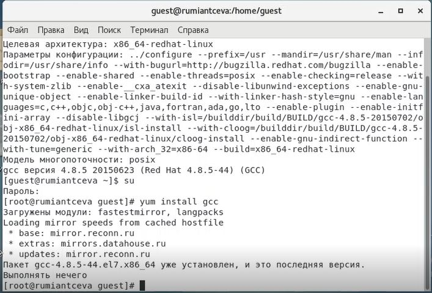{ #fig:001 width=60% }

## Выполнение основной частии лабораторной работы

1. Вошла в систему от имени пользователя guest.

2. Создала программу simpleid.c (рис. 2).

   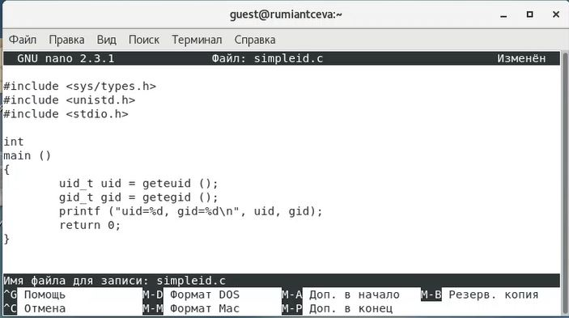{ #fig:002 width=60% }

3. Скомплилировала программу и убедилась, что файл программы создан командой gcc simpleid.c -o simpleid (рис. 3).

4. Выполнила программу simpleid командой ./simpleid (рис. 3).

5. Выполнила системную программу id и сравнина полученный результат с данными предыдущего пункта задания (рис. 3). Видим, что пользователи и группы совпадают. При этом команда id вывела действительные идентификаторы, а программа вывела эффективные, но при этом они совпадают и выводят 1001, то есть пользователя guest.

   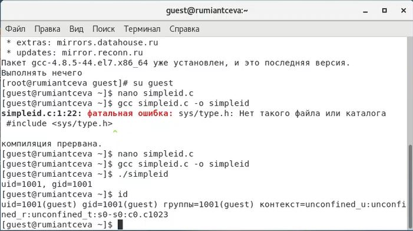{ #fig:003 width=60% }

6. Усложнила программу, добавив вывод действительных идентификаторов, получившуюся программу назовала simpleid2.c (рис. 4).

   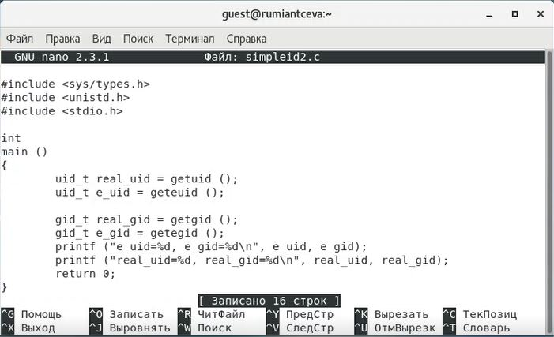{ #fig:004 width=60% }

7. Скомпилировала и запустила simpleid2.c командами gcc simpleid2.c -o simpleid2 и ./simpleid2 (рис. 5). Видим, что программа выводит эффективные и действительные идентификаторы пользователя и группы для файла. Видим, что везде это 1001, то есть пользователь guest.

   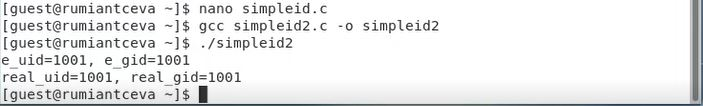{ #fig:005 width=60% }

8-9. От имени суперпользователя выполнила команды:chown root:guest /home/guest/simpleid2 и chmod u+s /home/guest/simpleid2. Временно поменяв свои права с помощью su (рис. 6).

С помощью этих команд файлу simpleid2 изменила владельца и группу на root и guest соответственно (chown), а также установила на файл SetUID-бит (chmod).

10. Выполнила проверку правильности установки новых атрибутов и смены владельца файла simpleid2 командой ls -l simpleid2 (рис. 6).

11. Запустила simpleid2 и id командами ./simpleid2 и id (рис. 6). Сравнила результаты: действительные идентификаторы совпадают с выводом команды id - везде 0, то есть рут-пользователь. Так же важно заметить, что эффективные идентификаторы совпадают с действительными.

   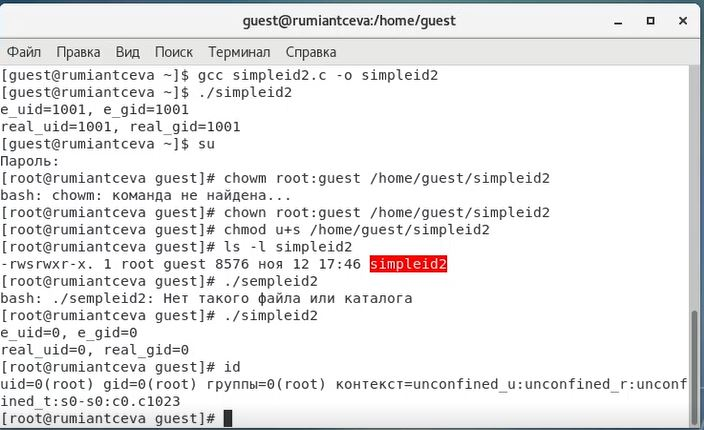{ #fig:006 width=60% }

12. Проделала тоже самое относительно SetGID-бита (рис. 7)

Установка SetGID-бита отражается к команде ls, а сравнение выполнения программы и команды id дало следующие результаты: действительные идентификаторы совпадают с выводом команды id - везде 0, то есть рут-пользователь. Но так же важно заметить, что эффективные идентификаторы отличны от действительных: пользователь - 0, группа - 1001.

   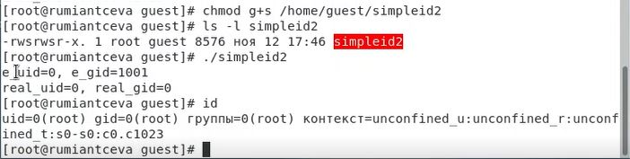{ #fig:007 width=60% }

13. Создала программу readfile.c (рис. 8).

   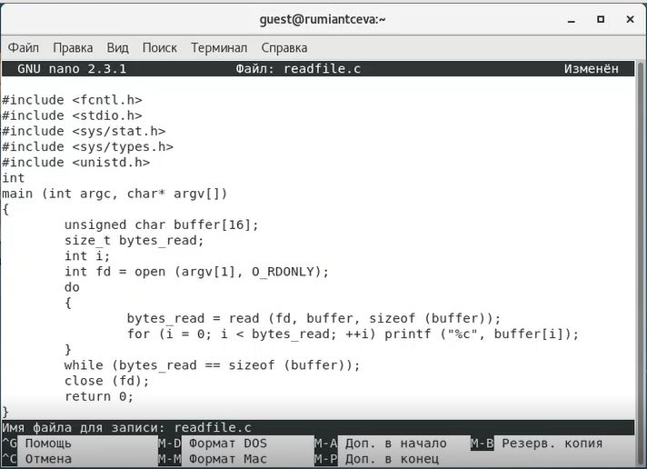{ #fig:008 width=60% }

14. Откомпилировала её командой gcc readfile.c -o readfile (рис. 9).

15. Сменила владельца у файла readfile.c (chown) и изменила права так, чтобы только суперпользователь (root) мог прочитать его, a guest не мог. Использовала chmod a-r (рис. 9).

16. Проверила, что пользователь guest не может прочитать файл readfile.c командой cat (рис. 9).

17. Сменила у программы readfile владельца и установила SetUID-бит (рис. 9).

   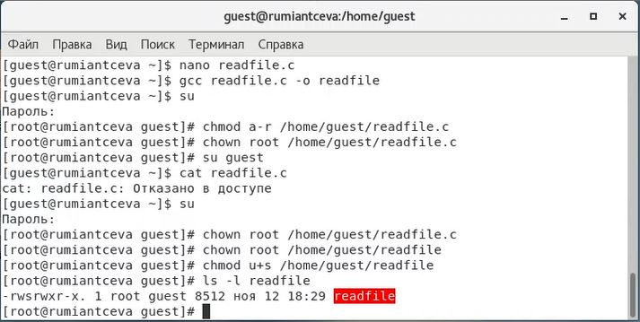{ #fig:009 width=60% }

18. Проверила, может ли программа readfile прочитать файл readfile.c. Да, может (рис. 10).

   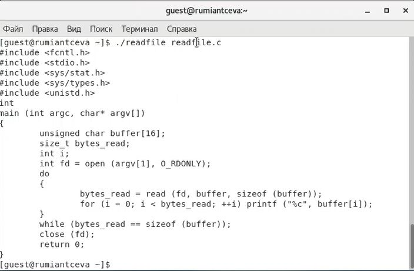{ #fig:010 width=60% }

19. Проверила, может ли программа readfile прочитать файл /etc/shadow. Её выполненеи возможно в том числе, так как владельцем файла являктся root-пользователь (рис. 11).

   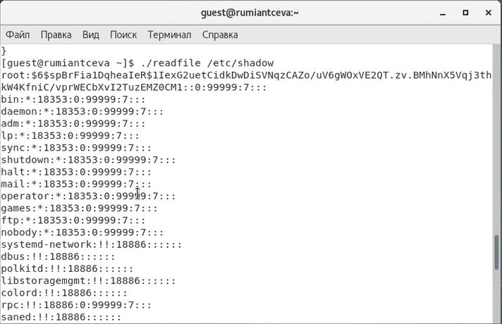{ #fig:011 width=60% }

## Исследование Sticky-бита

1. Выяснила, установлен ли атрибут Sticky на директории /tmp, для чего выполнила команду ls -l / | grep tmp (рис. 12). Видим, что установлен, так как есть буква t.

2. От имени пользователя guest создала файл file01.txt в директории /tmp со словом test командой echo "test" > /tmp/file01.txt (рис. 12).

3. Просмотрела атрибуты у только что созданного файла и разрешила чтение и запись для категории пользователей «все остальные». Выполнила команды ls -l /tmp/file01.txt и chmod o+rw /tmp/file01.txt  и ls -l /tmp/file01.txt (рис. 12).

4. От пользователя guest2 (не являющегося владельцем) попробовала прочитать файл /tmp/file01.txt командой cat /tmp/file01.txt (рис. 12).

   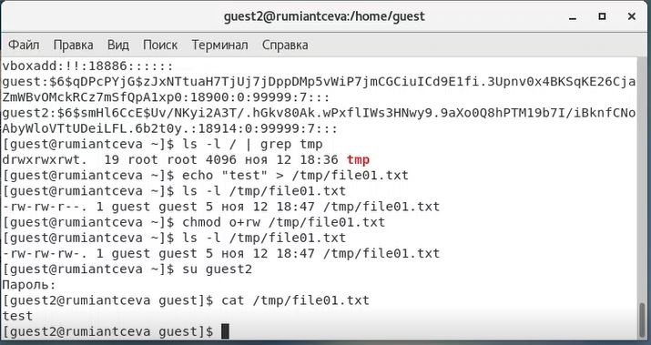{ #fig:012 width=60% }

5. От пользователя guest2 попробовала дозаписать в файл /tmp/file01.txt слово test2 командой echo "test2" >> /tmp/file01.txt. Мне удалось выполнить операцию (рис. 13).

6. Проверила содержимое файла командой cat /tmp/file01.txt (рис. 13).

7. От пользователя guest2 попробовала записать в файл /tmp/file01.txt слово test3, стерев при этом всю имеющуюся в файле информацию командой echo "test3" > /tmp/file01.txt. Мне удалось выполнить операцию (рис. 13).

8. Проверила  содержимое файла командой cat /tmp/file01.txt (рис. 13).

9. От пользователя guest2 попробовала удалить файл /tmp/file01.txt командой rm /tmp/fileOl.txt. Мне нее удалось удалить файл (рис. 13).

   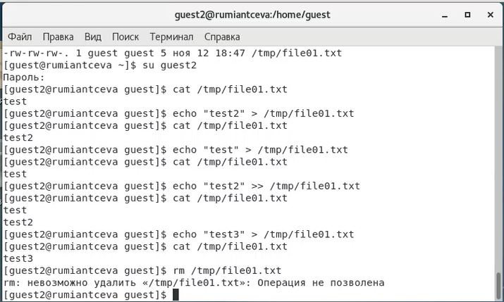{ #fig:013 width=60% }

Можем сделать вывод, что разрешена дозапись в файл, запись в файл, но мы не можем удалять файл из директории, на которую установлен атрибут Sticky.

10. Повысила свои права до суперпользователя следующей командой su - и выполнила после этого команду, снимающую атрибут t (Sticky-бит) с директории /tmp: chmod -t /tmp (рис. 14).

11. Покинула режим суперпользователя командой exit (рис. 14).

12. От пользователя guest2 проверила, что атрибута t у директории /tmp нет: ls -l / | grep tmp (рис. 14).

13. Повторила предыдущие шаги (рис. 14). Видим, что дозапись и запись так же разрешены, но при этом удалось и удалить файл.

   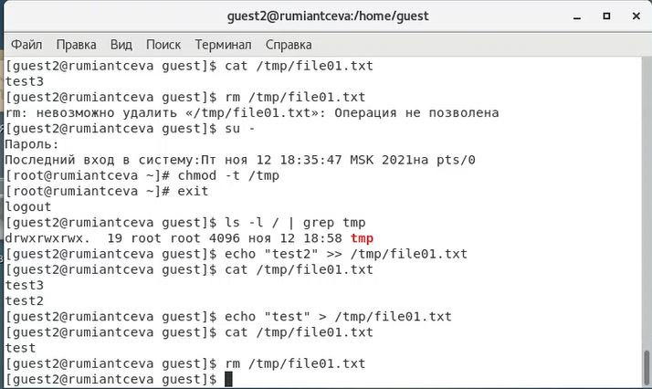{ #fig:014 width=60% }

14. Мне удалось удалить файл от имени пользователя, не являющегося его владельцем. Именно об этом и была часть теории выше.

15. Повысила свои права до суперпользователя и верните атрибут t на директорию /tmp: su -, chmod +t /tmp, exit (рис. 15).

   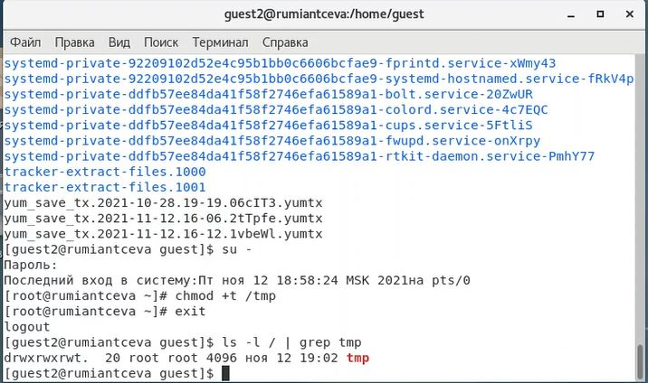{ #fig:015 width=60% }

# Библиография

1. ТУИС РУДН

2. Статья "КОМАНДА CHMOD В LINUX (ПРАВА ДОСТУПА К ФАЙЛАМ)" на сайте baks.ru <https://baks.dev/article/terminal/chmod-command-in-linux-file-permissions>

3. Статья "Фундаментальные основы Linux" на сайте zalinux.ru <http://rus-linux.net/MyLDP/BOOKS/Linux_Foundations/31/ch31.html> 

# Выводы

Я изучила механизмы изменения идентификаторов, применения SetUID- и Sticky-битов. Получила практические навыки работы в консоли с дополнительными атрибутами. Рассмотрела работу механизма смены идентификатора процессов пользователей, а также влияние бита Sticky на запись и удаление файлов.
