---
## Front matter
lang: ru-RU
title: Лабораторная работа №6
subtitle: 'Мандатное разграничение прав в Linux'
author: 'Румянцева Александра Сергеевна'
date: 27 ноября, 2021

## Formatting
toc: false
slide_level: 2
theme: metropolis
mainfont: Ubuntu
romanfont: Ubuntu
sansfont: Ubuntu
monofont: Ubuntu
header-includes: 
 - \metroset{progressbar=frametitle,sectionpage=progressbar,numbering=fraction}
 - '\makeatletter'
 - '\beamer@ignorenonframefalse'
 - '\makeatother'
aspectratio: 43
section-titles: true
---

## Цели и задание на лабораторную работу

Цель: Развить навыки администрирования ОС Linux. Получить первое практическое знакомство с технологией SELinux. Проверить работу SELinux на практике совместно с веб-сервером Apache.

Задание: Лабораторная работа подразумевает изучение технологий SELinux и веб-сервера Apache опытным путём.

## Подготовка к выполнению лабораторной работы

Установила от имени суперпользователя веб-сервер Apache с помощью команды yum install httpd. В моём случаи оказалось, что он уже установлен.

В конфигурационном файле /etc/httpd/httpd.conf задала параметр ServerName: ServerName test.ru

С помощью команд сделала так, чтоюы пакетный фильтр в своей рабочей конфигурации позволял подключаться к 80-му и 81-му портам протокола tcp, добавив разрешающие правила (рис. 1). 

   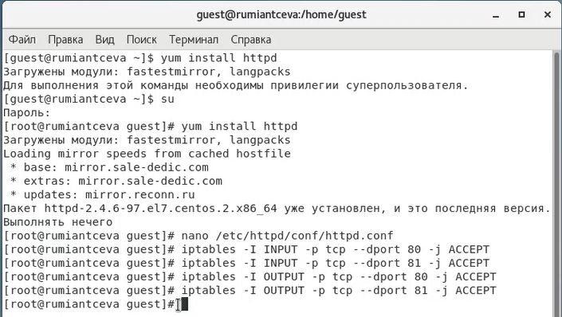{ #fig:001 width=60% }

## Выполнение основной частии лабораторной работы

1. Вошла в систему с полученными учётными данными и убедилась, что SELinux работает в режиме enforcing политики targeted с помощью команд getenforce и sestatus (рис.2).

   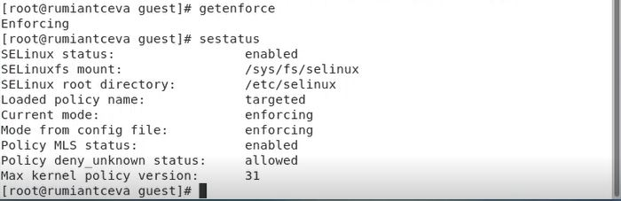{ #fig:002 width=60% }

---

Обратилась к веб-серверу, запущенному на нашем компьютере, и убедимся, что последний работает: service httpd status (рис. 3).

   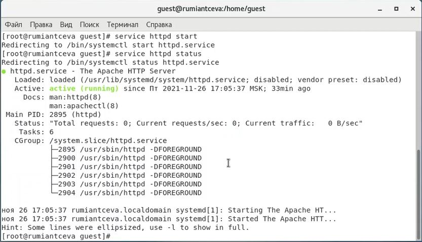{ #fig:003 width=60% }

---

Нашла веб-сервер Apache в списке процессов, определила его контекст безопасности, используя команду ps auxZ | grep httpd (рис. 4).

   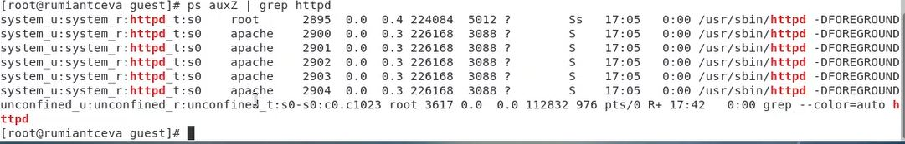{ #fig:004 width=60% }

---

Посмотрела текущее состояние переключателей SELinux для Apache с помощью команды sestatus –b | grep httpd (рис. 5).
   
   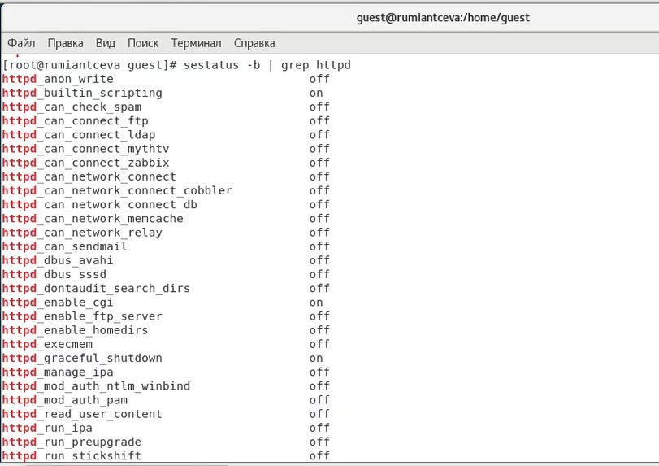{ #fig:005 width=60% }

---

Посмотрела статистику по политике с помощью команды seinfo, также определила множество пользователей, ролей и типов. (рис. 6)

Замечу, что для выполнения команды пришлось выполнить установку setools-console

   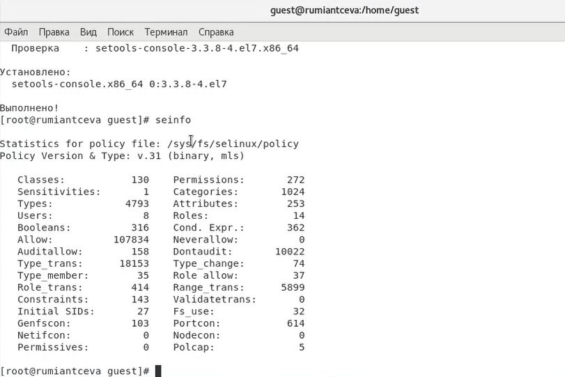{ #fig:006 width=60% }

Из рисунка наглядно видно, что пользователей: 8, ролей: 14, типов: 4793.

---

Опытным путём определила, что только суперпользователь может создать файл в данной директории (рис. 7). Поэтому создала от имени суперпользователя html-файл /var/www/html/test.html с содержанием, которое требовалось в задании:

<html>

<body>test</body>

</html>

Проверила контекст созданного файла: контекст, присваиваемый по умолчанию вновь созданным файлам в директории /var/www/html: unconfined_u:object_r:httpd_sys_content_t

   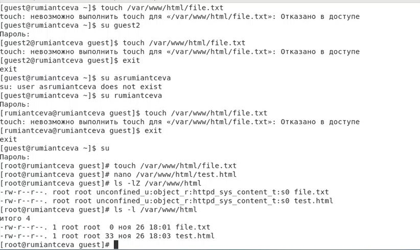{ #fig:007 width=60% }

---

Обратилась к файлу через веб-сервер, введя в браузере firefox адрес: http://127.0.0.1/test.html. Файл был успешно отображен (рис. 8).

   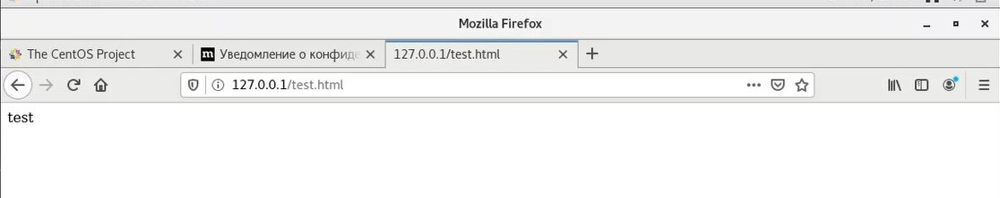{ #fig:008 width=60% }

Изменила контекст файла /var/www/html/test.html с httpd_sys_content_t на другой, к которому процесс httpd не имеет доступа (на samba_share_t) (рис. 9).

   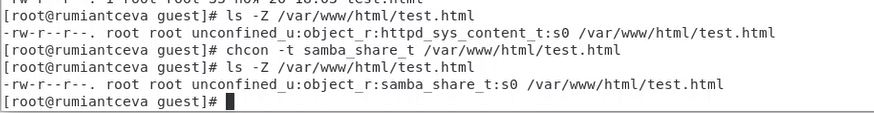{ #fig:009 width=60% }

Попробовала получить доступ к файлу через веб-сервер, введя в браузере адрес http://127.0.0.1/test.html. Но получила сообщение об ошибке (рис. 10).

   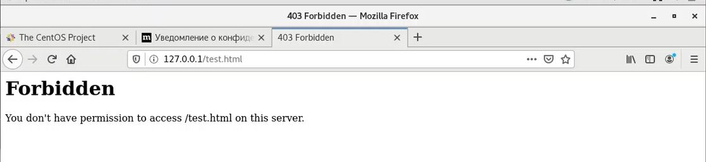{ #fig:010 width=60% }

---

Попробовала запустить веб-сервер Apache на прослушивание TCP-порта 81 (а не 80, как рекомендует IANA и прописано в /etc/services), заменив в файле /etc/httpd/conf/httpd.conf строчку Listen 80 на Listen 81.

Перезапустила веб-сервер Apache и попробовала обратиться к файлу через веб-сервер, введя в браузере firefox адрес http://127.0.0.1/test.html (рис. 11).

   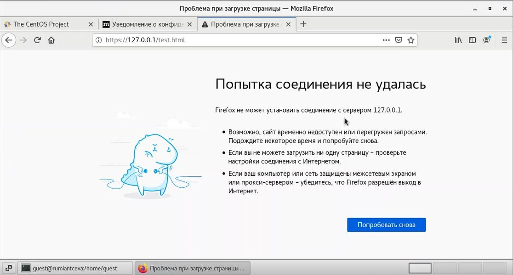{ #fig:011 width=60% }

---

Выполнила команду semanage port –a –t http_port_t –p tcp 81 и после этого проверила список портов командой semanage port –l | grep http_port_t (рис. 12).

   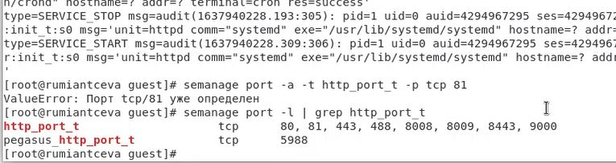{ #fig:012 width=60% }

Попробовала запустить веб-сервер Apache еще раз. Он успешно запустился. Вернула контекст httpd_sys_content_t к файлу /var/www/html/test.html: chcon –t httpd_sys_content_t /var/www/html/test.html.

После вновь попробовала получить доступ к файлу через веб-сервер, введя в браузере firefox адрес http://127.0.0.1:81/test.html (рис. 14). Увидели слово содержимое файла - слово «test».

   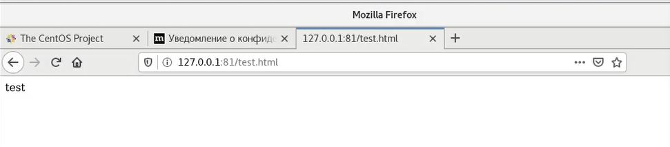{ #fig:013 width=60% }

---

Попробовала удалить привязку http_port_t к 81 порту: semanage port –d –t http_port_t –p tcp 81. Данную команду выполнить невозможно на моей версии CentOS, так как порт 81 определён на уровне политики.

Удалила файл /var/www/html/test.html: rm /var/www/html/test.html

   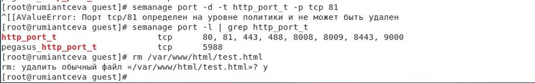{ #fig:014 width=60% }

## Выводы

Я развила навыки администрирования ОС Linux. Получила первое практическое знакомство с технологией SELinux. Проверила работу SELinux на практике совместно с веб-сервером Apache.