---
# Front matter
lang: ru-RU
title: 'Отчёт по лабораторной работе 6'
subtitle: 'Мандатное разграничение прав в Linux'
author: 'Румянцева Александра Сергеевна'

# Formatting
toc-title: 'Содержание'
toc: true # Table of contents
toc_depth: 2
lof: true # List of figures
lot: true # List of tables
fontsize: 12pt
linestretch: 1.5
papersize: a4paper
documentclass: scrreprt
polyglossia-lang: russian
polyglossia-otherlangs: english
mainfont: PT Serif
romanfont: PT Serif
sansfont: PT Sans
monofont: PT Mono
mainfontoptions: Ligatures=TeX
romanfontoptions: Ligatures=TeX
sansfontoptions: Ligatures=TeX,Scale=MatchLowercase
monofontoptions: Scale=MatchLowercase
indent: true
pdf-engine: lualatex
header-includes:
  - \linepenalty=10 # the penalty added to the badness of each line within a paragraph (no associated penalty node) Increasing the value makes tex try to have fewer lines in the paragraph.
  - \interlinepenalty=0 # value of the penalty (node) added after each line of a paragraph.
  - \hyphenpenalty=50 # the penalty for line breaking at an automatically inserted hyphen
  - \exhyphenpenalty=50 # the penalty for line breaking at an explicit hyphen
  - \binoppenalty=700 # the penalty for breaking a line at a binary operator
  - \relpenalty=500 # the penalty for breaking a line at a relation
  - \clubpenalty=150 # extra penalty for breaking after first line of a paragraph
  - \widowpenalty=150 # extra penalty for breaking before last line of a paragraph
  - \displaywidowpenalty=50 # extra penalty for breaking before last line before a display math
  - \brokenpenalty=100 # extra penalty for page breaking after a hyphenated line
  - \predisplaypenalty=10000 # penalty for breaking before a display
  - \postdisplaypenalty=0 # penalty for breaking after a display
  - \floatingpenalty = 20000 # penalty for splitting an insertion (can only be split footnote in standard LaTeX)
  - \raggedbottom # or \flushbottom
  - \usepackage{float} # keep figures where there are in the text
  - \floatplacement{figure}{H} # keep figures where there are in the text
---

# Цель работы

Развить навыки администрирования ОС Linux. Получить первое практическое знакомство с технологией SELinux. Проверить работу SELinux на практике совместно с веб-сервером Apache.

# Задание

Лабораторная работа подразумевает изучение технологий SELinux и веб-сервера Apache опытным путём.

# Теория

## SELinux

SELinux (SELinux) — это система принудительного контроля доступа, реализованная на уровне ядра. Впервые эта система появилась в четвертой версии CentOS, а в 5 и 6 версии реализация была существенно дополнена и улучшена. Эти улучшения позволили SELinux стать универсальной системой, способной эффективно решать массу актуальных задач. Стоит помнить, что классическая система прав Unix применяется первой, и управление перейдет к SELinux только в том случае, если эта первичная проверка будет успешно пройдена.

## Режимы работы SELinux

SELinux имеет три основных режим работы, при этом по умолчанию установлен режим Enforcing. Это довольно жесткий режим, и в случае необходимости он может быть изменен на более удобный для конечного пользователя.

Enforcing: Режим по-умолчанию. При выборе этого режима все действия, которые каким-то образом нарушают текущую политику безопасности, будут блокироваться, а попытка нарушения будет зафиксирована в журнале.

Permissive: В случае использования этого режима, информация о всех действиях, которые нарушают текущую политику безопасности, будут зафиксированы в журнале, но сами действия не будут заблокированы.

Disabled: Полное отключение системы принудительного контроля доступа.

## Контроль доступа в SELinux

SELinux предоставляет следующие модели управления доступом:

Type Enforcement (TE): основной механизм контроля доступа, используемый в целевых политиках. Позволяет детально, на самом низком уровне управлять разрешениями. Самый гибкий, но и самый трудоемкий для системного администратора механизм.

Role-Based Access Control (RBAC): в этой модели права доступа реализуются в качестве ролей. Ролью называется разрешения на выполнение определенных действий одним или несколькими элементами системы над другими частями системы. По-сути, RBAC является дальнейшим развитием TE.

Multi-Level Security (MLS): многоуровневая модель безопасности, в которой всем объектам системы присваивается определенный уровень доступа. Разрешение или запрет доступа определяется только соотношением этих уровней.

Все процессы и файлы в рамках SELinux имеют контекст безопасности.
Давайте посмотрим на контекст на практике, подробно рассмотрев стартовую страницу веб-сервера Apache, находящуюся по адресу /var/www/html/index.html

$ ls -Z /var/www/html/index.html 

-rw-r--r--  username username system_u:object_r:httpd_sys_content_t /var/www/html/index.html

В дополнение к стандартным правам доступа к файлу, мы можем видеть контекст безопасности SELinux: system_u: object_r: httpd_sys_content_t.

Контекст базируется на user:role:type:mls, но поля user:role:type отображаются, в то время как поле mls скрыто. Также мы можем видеть целевую политику, в данном случае httpd_sys_content_t.

Теперь рассмотрим контекст безопасности SELinux для процесса 'httpd' (веб-сервер Apache):

$ ps axZ | grep httpd

system_u:system_r:httpd_t        3234 ?        Ss     0:00 /usr/sbin/httpd

Как мы видим, этот процесс запущен на домене httpd_t.

Ну а теперь давайте посмотрим на контекст безопасности файла в нашем домашнем каталоге:

$ ls -Z /home/username/myfile.txt

-rw-r--r--  username username user_u:object_r:user_home_t      /home/username/myfile.txt

Мы видим, что файл имеет тип user_home_t, этот тип присваивается по умолчанию всем файлам в домашнем каталоге.

Доступ разрешен только между элементами с одинаковым типом, именно поэтому веб-сервер Apache может без проблем читать файл /var/www/html/index.html, который имеет тип httpd_sys_content_t. В то же самое время, так как Apache запущен на домене httpd_t и не имеет заполненных полей userid:username, он не может получить доступ к файлу home/username/myfile.txt, хотя этот файл доступен для чтения процессам, для которых не определена целевая политика. Таким образом, если веб-сервер Apache будет взломан, то злоумышленник не сможет получить доступ к файлам или запускать процессы, которые не находятся в домене httpd_t.

# Выполнение лабораторной работы

## Подготовка к выполнению

1. Установила от имени суперпользователя веб-сервер Apache с помощью команды yum install httpd. В моём случаи оказалось, что он уже установлен (рис. 1)

   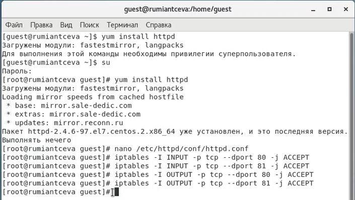{ #fig:001 width=60% }

2. В конфигурационном файле /etc/httpd/httpd.conf задала параметр ServerName: ServerName test.ru чтобы при запуске веб-сервера не выдавались лишние сообщения об ошибках, не относящихся к лабораторной работе (рис. 2).

   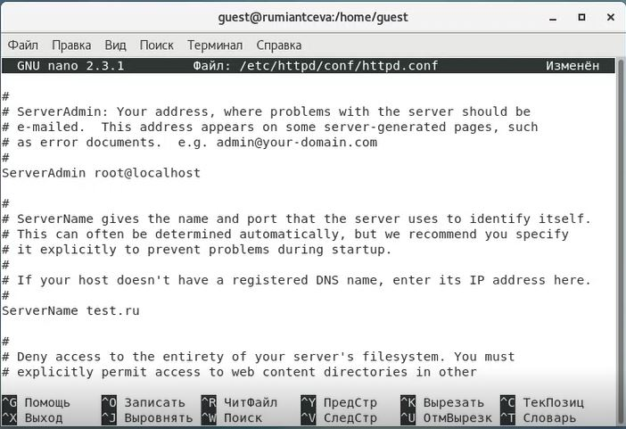{ #fig:002 width=60% }

3. Отключила пакетный фильтр, точнее сделала так, что он в своей рабочей конфигурации позволял подключаться к 80-му и 81-му портам протокола tcp, добавив разрешающие правила с помощью команд (рис. 1): 

iptables -I INPUT -p tcp --dport 80 -j ACCEPT

iptables -I INPUT -p tcp --dport 81 -j ACCEPT

iptables -I OUTPUT -p tcp --sport 80 -j ACCEPT

iptables -I OUTPUT -p tcp --sport 81 -j ACCEPT

Можно было бы также отключить фильтр командами:

iptables -F 

iptables -P INPUT ACCEPT iptables -P OUTPUT ACCEPT

## Выполнение основной частии лабораторной работы

1. Вошла в систему с полученными учётными данными и убедилась, что SELinux работает в режиме enforcing политики targeted с помощью команд getenforce и sestatus (рис.3).

   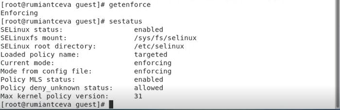{ #fig:003 width=60% }

2. Обратилась к веб-серверу, запущенному на нашем компьютере, и убедимся, что последний работает: service httpd status (рис. 4).

   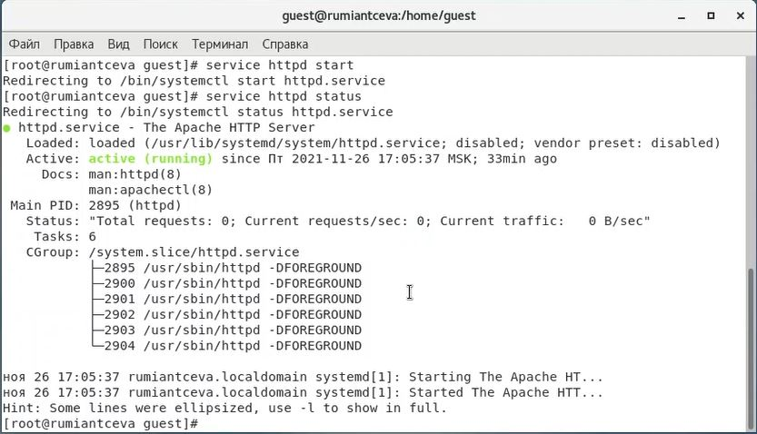{ #fig:004 width=60% }

3. Нашла веб-сервер Apache в списке процессов, определила его контекст безопасности, используя команду ps auxZ | grep httpd (рис. 5).

   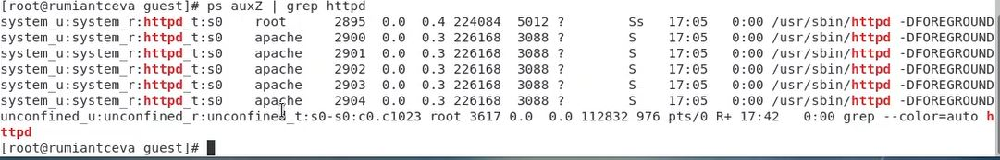{ #fig:005 width=60% }

В моём случае процесс запущен на домене httpd_t.

4. Посмотрела текущее состояние переключателей SELinux для Apache с помощью команды sestatus –b | grep httpd (рис. 6).
   
   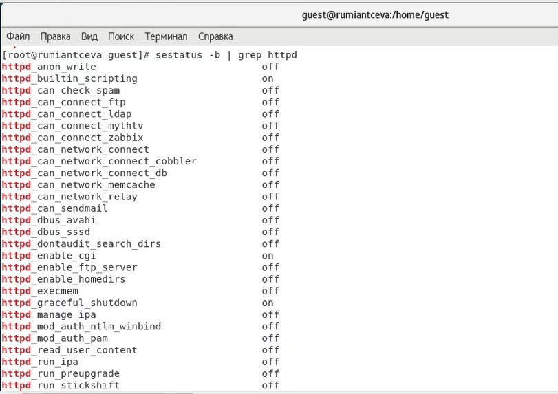{ #fig:006 width=60% }

Наглядно видно, что многие из переключателей находятся в положении «off».

5. Посмотрела статистику по политике с помощью команды seinfo, также определила множество пользователей, ролей и типов. (рис. 7)

Замечу, что для выполнения команды пришлось выполнить установку setools-console

   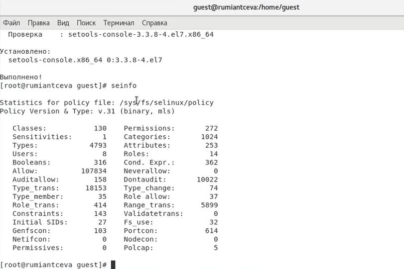{ #fig:007 width=60% }

Из рисунка наглядно видно, что пользователей: 8, ролей: 14, типов: 4793.

6. Определила тип файлов и поддиректорий, находящихся в директории /var/www с помощью команды ls -lZ /var/www (рис. 8).

7. Определила тип файлов, находящихся в директории /var/www/html с помощью команды ls –lZ /var/www/html (рис. 8). Директория оказалась пустой

   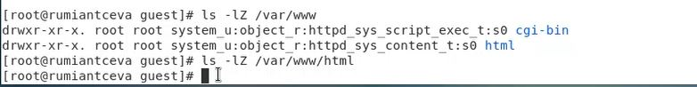{ #fig:008 width=60% }

8. Определила круг пользователей, которым разрешено создание файлов в директории /var/www/html (рис. 9).

Я выполнила команду touch, команду создания файла, для каждого пользователя. Таким образом я опытным путёи определила, что только суперпользователь может создать файл в данной директории.

   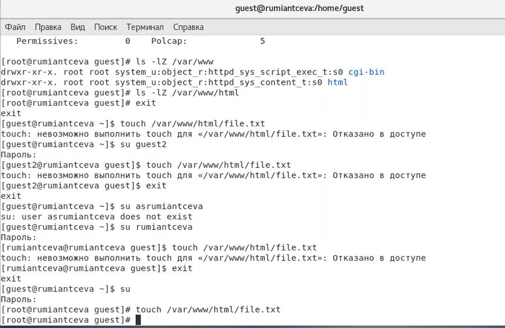{ #fig:009 width=60% }

9. Создала от имени суперпользователя html-файл /var/www/html/test.html следующего содержания (рис. 10):

<html>

<body>test</body>

</html>

   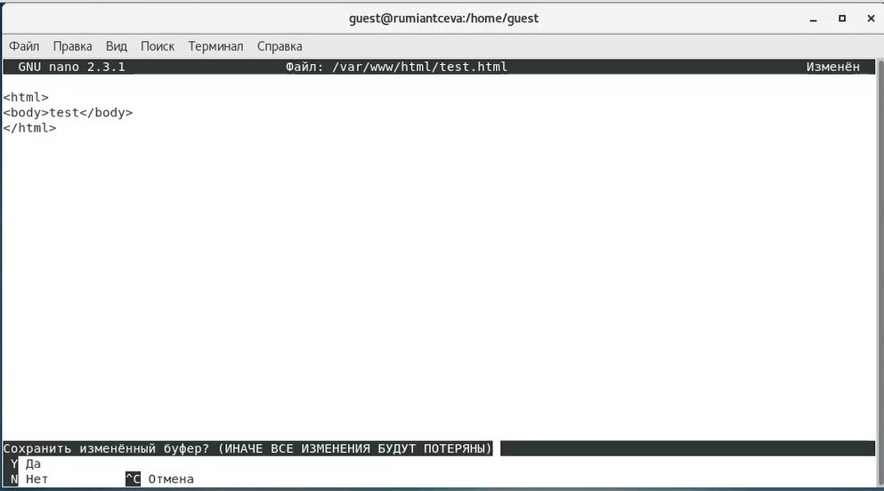{ #fig:010 width=60% }

10. Проверила контекст созданного файла (рис. 11).

Контекст, присваиваемый по умолчанию вновь созданным файлам в директории /var/www/html: unconfined_u:object_r:httpd_sys_content_t

   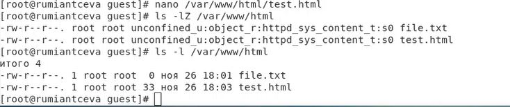{ #fig:011 width=60% }

11. Обратилась к файлу через веб-сервер, введя в браузере firefox адрес: http://127.0.0.1/test.html. Убедилась, что файл был успешно отображен (рис. 12).

   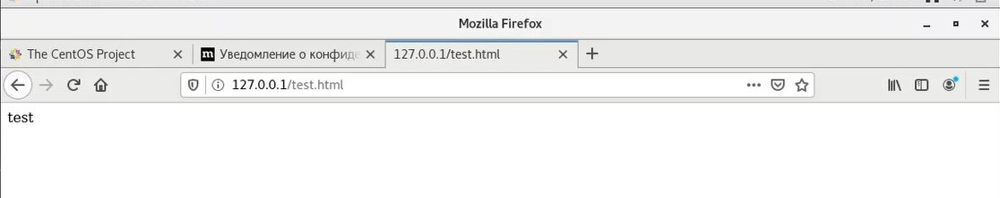{ #fig:012 width=60% }

12. Изучила справку man httpd_selinux и выяснила, какие контексты файлов определены для httpd и сопоставим их с типом файла test.html. Проверила контекст файла командой ls –Z /var/www/html/test.html (рис. 13).

Т.к. по умолчанию пользователи CentOS являются свободными (unconfined) от типа, созданному нами файлу test.html был сопоставлен SELinux, пользователь unconfined_u. Это первая часть контекста.

Далее политика ролевого разделения доступа RBAC используется процессами, но не файлами, поэтому роли не имеют никакого значения для файлов. Роль object_r используется по умолчанию для файлов на «постоянных» носителях и на сетевых файловых системах.

Тип httpd_sys_content_t позволяет процессу httpd получить доступ к файлу. Благодаря наличию последнего типа мы получили доступ к файлу при обращении к нему через браузер.

13. Изменила контекст файла /var/www/html/test.html с httpd_sys_content_t на другой, к которому процесс httpd не должен иметь доступа, в нашем случае, на samba_share_t и проверила изменения (рис. 13).

   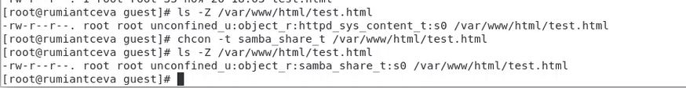{ #fig:013 width=60% }

14. Попробовала еще раз получить доступ к файлу через веб-сервер, введя в браузере firefox адрес http://127.0.0.1/test.html. Но получила сообщение об ошибке (рис. 14).

   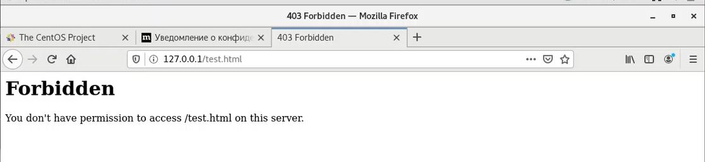{ #fig:014 width=60% }

15. Проанализировала ситуацию, просмотрев log-файлы веб-сервера Apache, системный log-файл и audit.log при условии уже запущенных процессов setroubleshootd и audtd (рис. 15).

   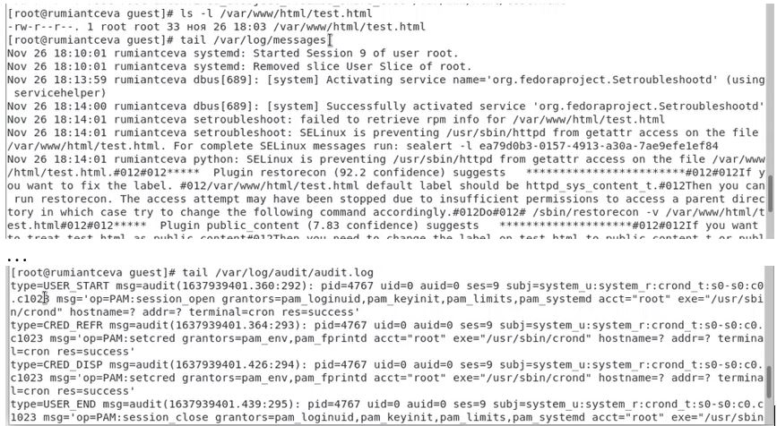{ #fig:015 width=60% }

Исходя из log-файлов, мы можем заметить, что проблема в измененном контексте на шаге 13, т.к. процесс httpd не имеет доступа на samba_share_t. В системе оказались запущены процессы setroubleshootd и audtd, поэтому ошибки, связанные с измененным контекстом, также есть в файле /var/log/audit/audit.log.

16. Попробовала запустить веб-сервер Apache на прослушивание TCP-порта 81 (а не 80, как рекомендует IANA и прописано в /etc/services), заменив в файле /etc/httpd/conf/httpd.conf строчку Listen 80 на Listen 81 (рис. 16).

   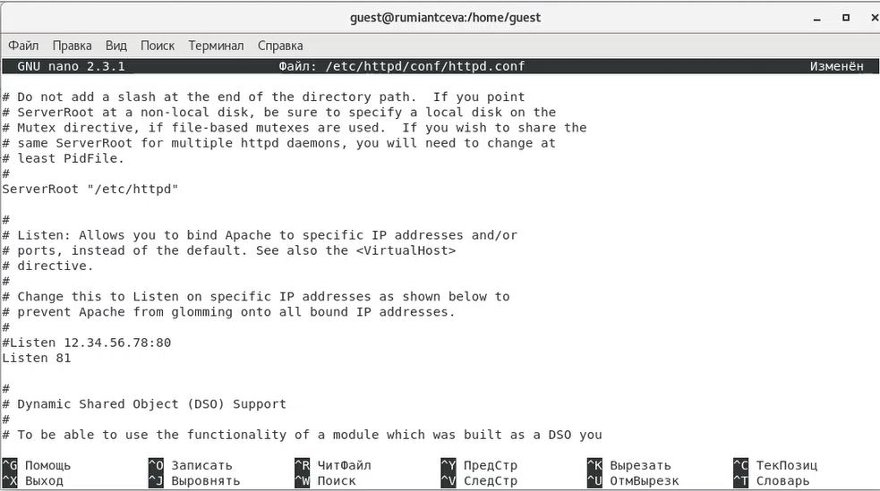{ #fig:016 width=60% }

17. Перезапустила веб-сервер Apache и попробовала обратиться к файлу через веб-сервер, введя в браузере firefox адрес http://127.0.0.1/test.html (рис. 17, 18).

   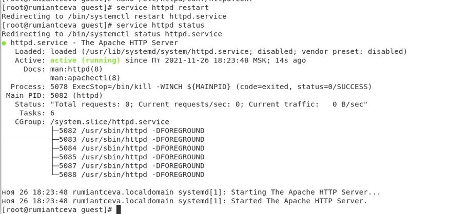{ #fig:017 width=60% }

   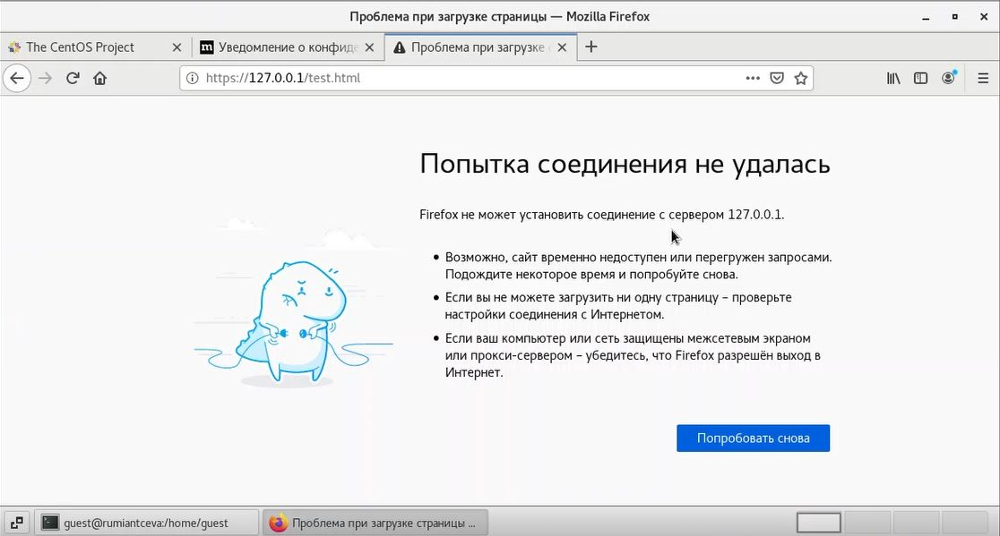{ #fig:018 width=60% }

Из того, что при запуске файла через браузер появилась ошибка, можно сделать предположение, что в списках портов, работающих с веб-сервером Apache, отсутствует порт 81.

18. Проанализировала log-файлы: tail –n1  /var/log/messages и просмотрела файлы /var/log/http/error_log, /var/log/http/access_log и /var/log/audit/audit.log. Во всех log-файлах появились записи, кроме /var/log/messages.

19. Выполнила команду semanage port –a –t http_port_t –p tcp 81 и после этого проверила список портов командой semanage port –l | grep http_port_t (рис. 19).

   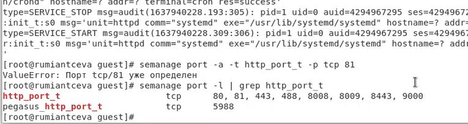{ #fig:019 width=60% }

Заметим, что порт 81 уже определён, и он лействительно есть в списке портов, так как данный порт определён на уровне политики..

20. Попробовала запустить веб-сервер Apache еще раз. Он успешно запустился.

21. Вернула контекст httpd_sys_content_t к файлу /var/www/html/test.html: chcon –t httpd_sys_content_t /var/www/html/test.html (рис. 20).

   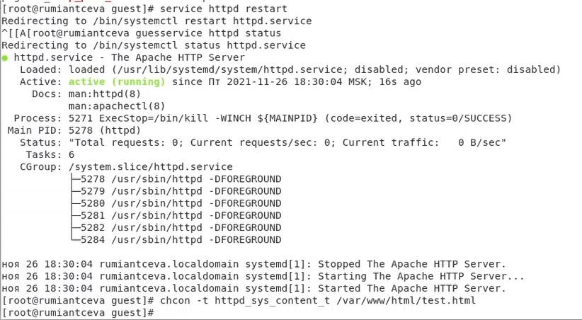{ #fig:020 width=60% }

После вновь попробовала получить доступ к файлу через веб-сервер, введя в браузере firefox адрес http://127.0.0.1:81/test.html (рис. 21). Увидели слово содержимое файла - слово «test».

   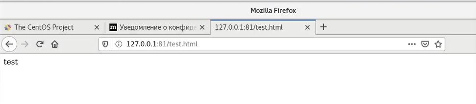{ #fig:021 width=60% }

22. Исправила обратно конфигурационный файл apache, вернув Listen 80. 

23. Попробовала удалить привязку http_port_t к 81 порту: semanage port –d –t http_port_t –p tcp 81. Данную команду выполнить невозможно на моей версии CentOS, так как порт 81 определён на уровне политики (рис. 22).

   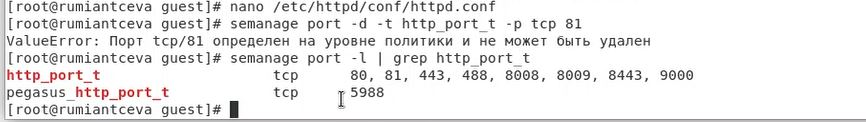{ #fig:022 width=60% }

24. Удалила файл /var/www/html/test.html: rm /var/www/html/test.html (рис. 23)

   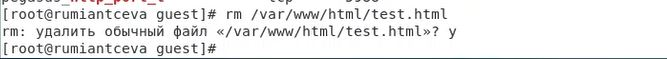{ #fig:023 width=60% }

# Библиография

1. ТУИС РУДН

2. Статья "SELinux – описание и особенности работы с системой." на сайте harb.com <https://habr.com/ru/company/kingservers/blog/209644/>

# Выводы

Я развила навыки администрирования ОС Linux. Получила первое практическое знакомство с технологией SELinux. Проверила работу SELinux на практике совместно с веб-сервером Apache.
