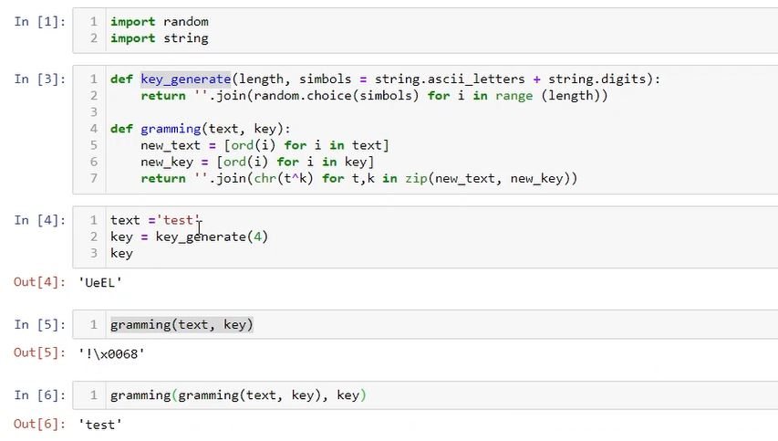
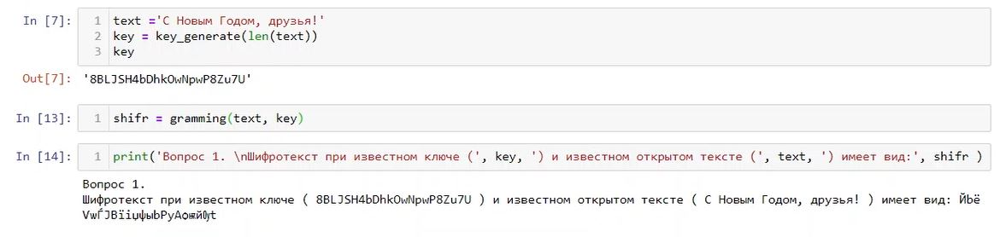
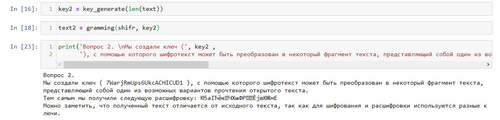
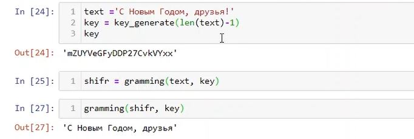
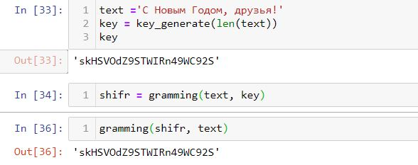

---
## Front matter
lang: ru-RU
title: Лабораторная работа №7
subtitle: 'Элементы криптографии. Однократное гаммирование'
author: 'Румянцева Александра Сергеевна'
date: 11 декабря, 2021

## Formatting
toc: false
slide_level: 2
theme: metropolis
mainfont: Ubuntu
romanfont: Ubuntu
sansfont: Ubuntu
monofont: Ubuntu
header-includes: 
 - \metroset{progressbar=frametitle,sectionpage=progressbar,numbering=fraction}
 - '\makeatletter'
 - '\beamer@ignorenonframefalse'
 - '\makeatother'
aspectratio: 43
section-titles: true
---

## Цели и задание на лабораторную работу

Цель: Освоить на практике применение режима однократного гаммирования.

Задание: Лабораторная работа подразумевает освоение граммирования опытным путем.

## Выполнение лабораторной работы

1. Изучила теорию и указание к лабораторной работе.

2. Написала программу, которая подобирает ключ, чтобы получить сообщение «С Новым Годом, друзья!»

Целью написанной программы является разработка приложения, позволяющего шифровать и дешифровать данные в режиме однократного гаммирования. Приложение должно:

1) Определить вид шифротекста при известном ключе и известном открытом тексте.

2) Определить ключ, с помощью которого шифротекст может быть преобразован в некоторый фрагмент текста, представляющий собой один из возможных вариантов прочтения открытого текста.

---

Я написала программу, состоящую из 2ух функций: функция генерации ключа шифрования, и функция граммирования. Затем я проверила корректность выполняемых действий программой (рис. 1).

   { #fig:001 width=80% }

---

1) Определила вид шифротекста при известном ключе и открытом тексте. Текст использовала из задания «С Новым Годом, друзья!» (рис. 2).

   { #fig:002 width=80% }

---

2) Определила ключ, с помощью которого шифротекст может быть преобразован в некоторый фрагмент текста, представляющий собой один из возможных вариантов прочтения открытого текста (рис. 3).

   { #fig:003 width=80% }

Как видно на рисунке 3, мы создали ключ key2, с помощью которого шифротекст может быть преобразован в некоторый фрагмент текста, представляющий собой один из возможных вариантов прочтения открытого текста.Тем самым мы получили расшифровку, которая отличается от исходного текста, так как для шифрования и расшифровки используются разные ключи.

## Контрольные вопросы

*1. Поясните смысл однократного гаммирования.*

Гаммирование – это наложение/снятие на открытые/зашифрованные данные криптографической гаммы, то есть последовательности элементов данных, вырабатываемых с помощью некоторого криптографического алгоритма, для получения зашифрованных/открытых данных. Однократное гаммирование – это когда каждый символ попарно с символом ключа складываются по модулю 2 (XOR).

*2. Перечислите недостатки однократного гаммирования.*

Размер ключевого материала должен совпадать с размером передаваемых сообщений.

   { #fig:004 width=70% }

## Контрольные вопросы

Необходимо иметь эффективные процедуры для выработки случайных равновероятных двоичных последовательностей и специальную службу для развоза огромного количества ключей. Если одну и ту же гамму использовать дважды для разных сообщений, то шифр из совершенно стойкого превращается в «совершенно нестойкий» и допускает дешифрование практически вручную.

*3. Перечислите преимущества однократного гаммирования.*

С точки зрения теории криптоанализа метод шифрования случайной однократной равновероятной гаммой той же длины, что и открытый текст, является невскрываемым. Кроме того, даже раскрыв часть сообщения, информация о вскрытом участке гаммы не дает информации об остальных ее частях. К достоинствам также можно отнести простоту реализации и удобство применения.

*4. Почему длина открытого текста должна совпадать с длиной ключа?*

Потому что каждый символ открытого текста складывается с символом ключа попарно. Иначе можно получить неполный текст, как рассматривали пример на рисунке 4.

## Контрольные вопросы

*5. Какая операция используется в режиме однократного гаммирования, назовите её особенности?*

В режиме однократного гаммирования используется сложение по модулю 2 (XOR) между элементами гаммы и элементами подлежащего сокрытию текста. Особенность заключается в том, что этот алгоритм шифрования является симметричным. Поскольку двойное прибавление одной и той же величины по модулю 2 восстанавливает исходное значение, шифрование и расшифрование выполняется одной и той же программой.

*6. Как по открытому тексту и ключу получить шифротекст?*

Если известны ключ и открытый текст, то задача нахождения шифротекста заключается в применении сложения по модулю 2 между каждым символом открытого текста и ключа. То есть выполняем однократное граммирование. 

## Контрольные вопросы

*7. Как по открытому тексту и шифротексту получить ключ?*

Если известны открытый текст и шифротекст, то задача нахождения ключа заключается в применении сложения по модулю 2 между каждым символом открытого текста и шифра. Пример рассмотрен на рисунке 5:

   { #fig:005 width=60% }

*8. В чем заключаются необходимые и достаточные условия абсолютной стойкости шифра?*

Необходимые и достаточные условия абсолютной стойкости шифра: полная случайность ключа; равенство длин ключа и открытого текста; однократное использование ключа.

## Выводы

Я освоила на практике применение режима однократного гаммирования.