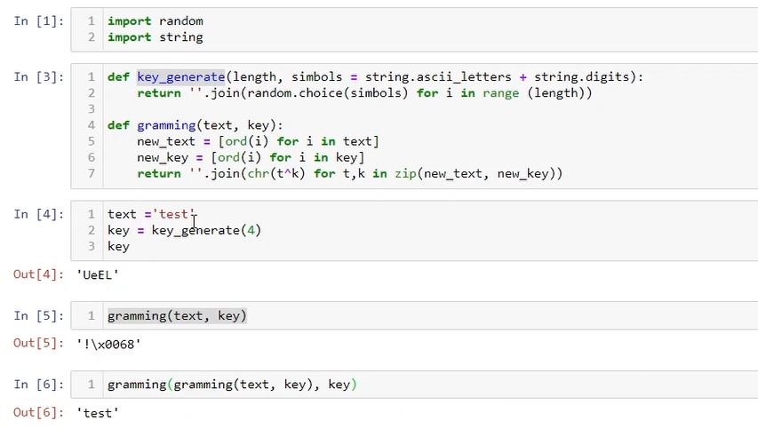
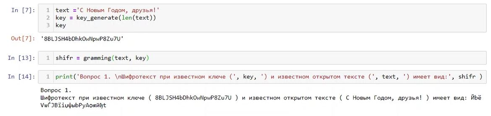

---
# Front matter
lang: ru-RU
title: 'Отчёт по лабораторной работе 7'
subtitle: 'Элементы криптографии. Однократное гаммирование'
author: 'Румянцева Александра Сергеевна'

# Formatting
toc-title: 'Содержание'
toc: true # Table of contents
toc_depth: 2
lof: true # List of figures
lot: true # List of tables
fontsize: 12pt
linestretch: 1.5
papersize: a4paper
documentclass: scrreprt
polyglossia-lang: russian
polyglossia-otherlangs: english
mainfont: PT Serif
romanfont: PT Serif
sansfont: PT Sans
monofont: PT Mono
mainfontoptions: Ligatures=TeX
romanfontoptions: Ligatures=TeX
sansfontoptions: Ligatures=TeX,Scale=MatchLowercase
monofontoptions: Scale=MatchLowercase
indent: true
pdf-engine: lualatex
header-includes:
  - \linepenalty=10 # the penalty added to the badness of each line within a paragraph (no associated penalty node) Increasing the value makes tex try to have fewer lines in the paragraph.
  - \interlinepenalty=0 # value of the penalty (node) added after each line of a paragraph.
  - \hyphenpenalty=50 # the penalty for line breaking at an automatically inserted hyphen
  - \exhyphenpenalty=50 # the penalty for line breaking at an explicit hyphen
  - \binoppenalty=700 # the penalty for breaking a line at a binary operator
  - \relpenalty=500 # the penalty for breaking a line at a relation
  - \clubpenalty=150 # extra penalty for breaking after first line of a paragraph
  - \widowpenalty=150 # extra penalty for breaking before last line of a paragraph
  - \displaywidowpenalty=50 # extra penalty for breaking before last line before a display math
  - \brokenpenalty=100 # extra penalty for page breaking after a hyphenated line
  - \predisplaypenalty=10000 # penalty for breaking before a display
  - \postdisplaypenalty=0 # penalty for breaking after a display
  - \floatingpenalty = 20000 # penalty for splitting an insertion (can only be split footnote in standard LaTeX)
  - \raggedbottom # or \flushbottom
  - \usepackage{float} # keep figures where there are in the text
  - \floatplacement{figure}{H} # keep figures where there are in the text
---

# Цель работы

Освоить на практике применение режима однократного гаммирования.

# Задание

Лабораторная работа подразумевает освоение граммирования опытным путем.

# Теория

Граммирование - метод симметричного шифрования, заключающийся в «наложении» последовательности, состоящей из случайных чисел, на открытый текст. Последовательность случайных чисел называется гамма-последовательностью и используется для зашифровывания и расшифровывания данных. Суммирование обычно выполняется в каком-либо конечном поле.

Принцип шифрования гаммированием заключается в генерации гаммы шифра с помощью датчика псевдослучайных чисел и наложении полученной гаммы шифра на открытые данные обратимым образом (например, используя операцию сложения по модулю 2). Процесс дешифрования сводится к повторной генерации гаммы шифра при известном ключе и наложении такой же гаммы на зашифрованные данные.

Полученный зашифрованный текст является достаточно трудным для раскрытия в том случае, если гамма шифра не содержит повторяющихся битовых последовательностей и изменяется случайным образом для каждого шифруемого слова. Если период гаммы превышает длину всего зашифрованного текста и неизвестна никакая часть исходного текста, то шифр можно раскрыть только прямым перебором (подбором ключа). В этом случае криптостойкость определяется размером ключа.

# Выполнение лабораторной работы

1. Изучила теорию и указание к лабораторной работе.

2. Написала программу, которая подобирает ключ, чтобы получить сообщение «С Новым Годом, друзья!»

Целью написанной программы является разработка приложения, позволяющего шифровать и дешифровать данные в режиме однократного гаммирования. Приложение должно:

1) Определить вид шифротекста при известном ключе и известном открытом тексте.

2) Определить ключ, с помощью которого шифротекст может быть преобразован в некоторый фрагмент текста, представляющий собой один из возможных вариантов прочтения открытого текста.

 Я написала программу, состоящую из 2ух функций: функция генерации ключа шифрования, и функция граммирования. Затем я проверила корректность выполняемых действий программой (рис. 1).

   { #fig:001 width=80% }

Как мы видим из рисунка, программа успешно генерирует ключ нужной длинны, с в его помощью может шифровать и обратно расшифрововать текст.

Выполним пункты задания:

1) Определила вид шифротекста при известном ключе и открытом тексте. Текст использовала из задания «С Новым Годом, друзья!» (рис. 2).

   { #fig:002 width=80% }

2) Определила ключ, с помощью которого шифротекст может быть преобразован в некоторый фрагмент текста, представляющий собой один из возможных вариантов прочтения открытого текста (рис. 3).

   { #fig:003 width=80% }

Как видно на рисунке 3, мы создали ключ key2, с помощью которого шифротекст может быть преобразован в некоторый фрагмент текста, представляющий собой один из возможных вариантов прочтения открытого текста.Тем самым мы получили расшифровку, которая отличается от исходного текста, так как для шифрования и расшифровки используются разные ключи.

# Контрольные вопросы

*1. Поясните смысл однократного гаммирования.*

Гаммирование – это наложение/снятие на открытые/зашифрованные данные криптографической гаммы, то есть последовательности элементов данных, вырабатываемых с помощью некоторого криптографического алгоритма, для получения зашифрованных/открытых данных.

Однократное гаммирование – это когда каждый символ попарно с символом ключа складываются по модулю 2 (XOR).

*2. Перечислите недостатки однократного гаммирования.*

Размер ключевого материала должен совпадать с размером передаваемых сообщений (как можно увидель на рисунке 4, в случаи несовпадения размером текст выводится неполный, тоесть теряется часть текста, поэтому размеры должны совпадать). Также необходимо иметь эффективные процедуры для выработки случайных равновероятных двоичных последовательностей и специальную службу для развоза огромного количества ключей. Если одну и ту же гамму использовать дважды для разных сообщений, то шифр из совершенно стойкого превращается в «совершенно нестойкий» и допускает дешифрование практически вручную.

   { #fig:004 width=80% }

*3. Перечислите преимущества однократного гаммирования.*

С точки зрения теории криптоанализа метод шифрования случайной однократной равновероятной гаммой той же длины, что и открытый текст, является невскрываемым. Кроме того, даже раскрыв часть сообщения, информация о вскрытом участке гаммы не дает информации об остальных ее частях. К достоинствам также можно отнести простоту реализации и удобство применения.

*4. Почему длина открытого текста должна совпадать с длиной ключа?*

Потому что каждый символ открытого текста складывается с символом ключа попарно. Иначе можно получить неполный текст, как рассматривали пример на рисунке 4.

*5. Какая операция используется в режиме однократного гаммирования, назовите её особенности?*

В режиме однократного гаммирования используется сложение по модулю 2 (XOR) между элементами гаммы и элементами подлежащего сокрытию текста. Особенность заключается в том, что этот алгоритм шифрования является симметричным. Поскольку двойное прибавление одной и той же величины по модулю 2 восстанавливает исходное значение, шифрование и расшифрование выполняется одной и той же программой.

*6. Как по открытому тексту и ключу получить шифротекст?*

Если известны ключ и открытый текст, то задача нахождения шифротекста заключается в применении сложения по модулю 2 между каждым символом открытого текста и ключа. То есть выполняем однократное граммирование. 

*7. Как по открытому тексту и шифротексту получить ключ?*

Если известны открытый текст и шифротекст, то задача нахождения ключа заключается в применении сложения по модулю 2 между каждым символом открытого текста и шифра. Пример рассмотрен на рисунке 5:

   { #fig:005 width=80% }

*8. В чем заключаются необходимые и достаточные условия абсолютной стойкости шифра?*

Необходимые и достаточные условия абсолютной стойкости шифра: полная случайность ключа; равенство длин ключа и открытого текста; однократное использование ключа.

# Библиография

1. ТУИС РУДН

2. Статья "Принцип шифрования гаммированием" на сайте <http://crypto.pp.ua/2010/04/82/>

# Выводы

Я освоила на практике применение режима однократного гаммирования.

