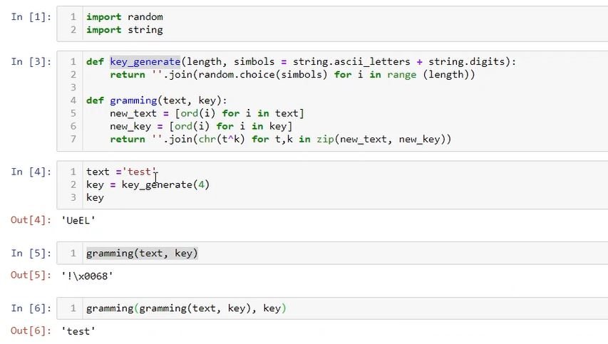
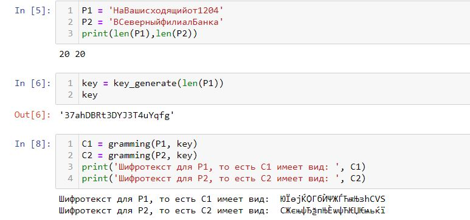
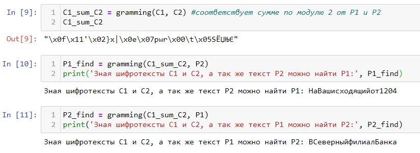
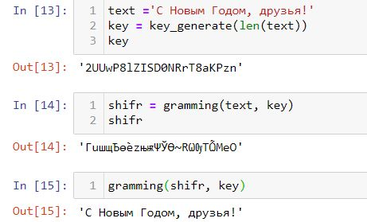

---
## Front matter
lang: ru-RU
title: Лабораторная работа №8
subtitle: 'Элементы криптографии. Шифрование (кодирование) различных исходных текстов одним ключом'
author: 'Румянцева Александра Сергеевна'
date: 18 декабря, 2021

## Formatting
toc: false
slide_level: 2
theme: metropolis
mainfont: Ubuntu
romanfont: Ubuntu
sansfont: Ubuntu
monofont: Ubuntu
header-includes: 
 - \metroset{progressbar=frametitle,sectionpage=progressbar,numbering=fraction}
 - '\makeatletter'
 - '\beamer@ignorenonframefalse'
 - '\makeatother'
aspectratio: 43
section-titles: true
---

## Цели и задание на лабораторную работу

Цель: Освоить на практике применение режима однократного гаммирования на примере кодирования различных исходных текстов одним ключом.

Задание: Лабораторная работа подразумевает освоение граммирования опытным путем на примере кодирования различных исходных текстов одним ключом.

## Выполнение лабораторной работы

1. Изучила теорию и указание к лабораторной работе.

2. Разработала приложение, позволяющее шифровать и дешифровать тексты P1 и P2 в режиме однократного гаммирования.

С помощью приложения нужно:

1) Определить вид шифротекстов C1 и C2 обоих текстов P1 и P2 при известном ключе;

2) Определить и выразить аналитически способ, при котором злоумышленник может прочитать оба текста, не зная ключа и не стремясь его определить.

---

Я написала программу, состоящую из 2ух функций (рис. 1): функция генерации ключа шифрования, и функция граммирования (выполнено в лабораторной 7).

   { #fig:001 width=80% }

---

Выполним пункты задания:

1) Определила вид шифротекстов C1 и C2 обоих текстов P1 и P2 при известном ключе. Текста P1 и P2 использовала из задания (рис. 2). При этом обратила внимание на длину текстов, так как важно, чтобы длина ключа совпадала с длиной текстов.

   { #fig:002 width=80% }

---

2) Определила и выразила аналитически способ, при котором злоумышленник может прочитать оба текста, не зная ключа и не стремясь его определить.

Для этого необходимо было произвести граммирование суммы по модулю 2 от шифротекстов и одного из исходных текстов, таким образом получаем расшифрованный второй текст (рис. 3).

   { #fig:003 width=80% }

## Контрольные вопросы

*1. Как, зная один из текстов (P1 или P2), определить другой, не зная при этом ключа?*

Определить неизвестный текст можно с помощью примерения однократного граммирования к сумме по модулю 2 для шифротекстов (т.е. их однократного граммирования) и ко второму известному тексту. 

*2. Что будет при повторном использовании ключа при шифровании текста?*

При повторном использовании ключа для текста (точнее для шифротекста, так как первым испольхованием ключа исходных текст шифруется) мы получаем исходный текст. 

   { #fig:004 width=50% }

## Контрольные вопросы

*3. Как реализуется режим шифрования однократного гаммирования одним ключом двух открытых текстов?*

Если два текста имеют одинаковую длину, то можно их зашифровать одним ключом. Для этого генерируется ключ необходимой длины (длины текстов) и поочерёдно применяется к текстам.

*4. Перечислите недостатки шифрования одним ключом двух открытых текстов.*

Главный недостаток - возможность расшифровки всех текстов, зашифрованных тем же ключом, что и текст, расшифровать который уже удалось.

*5.  Перечислите преимущества шифрования одним ключом двух открытых текстов.*

Простота использования, так как не нужно генерировать новые ключи для щифрования и знать новые ключи для расшифровки.

## Выводы

Я освоила на практике применение режима однократного гаммирования на примере кодирования различных исходных текстов одним ключом.