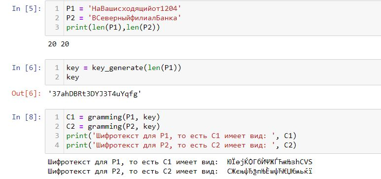
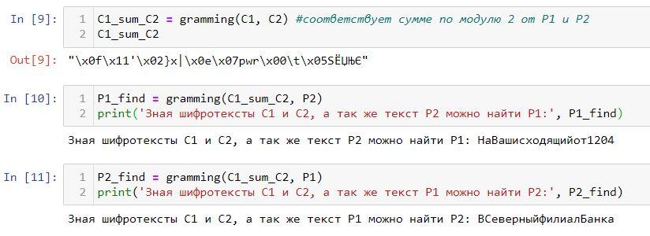
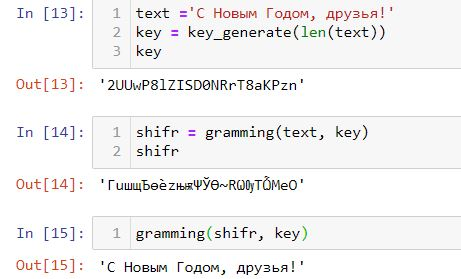

---
# Front matter
lang: ru-RU
title: 'Отчёт по лабораторной работе 8'
subtitle: 'Элементы криптографии. Шифрование (кодирование) различных исходных текстов одним ключом'
author: 'Румянцева Александра Сергеевна'

# Formatting
toc-title: 'Содержание'
toc: true # Table of contents
toc_depth: 2
lof: true # List of figures
lot: true # List of tables
fontsize: 12pt
linestretch: 1.5
papersize: a4paper
documentclass: scrreprt
polyglossia-lang: russian
polyglossia-otherlangs: english
mainfont: PT Serif
romanfont: PT Serif
sansfont: PT Sans
monofont: PT Mono
mainfontoptions: Ligatures=TeX
romanfontoptions: Ligatures=TeX
sansfontoptions: Ligatures=TeX,Scale=MatchLowercase
monofontoptions: Scale=MatchLowercase
indent: true
pdf-engine: lualatex
header-includes:
  - \linepenalty=10 # the penalty added to the badness of each line within a paragraph (no associated penalty node) Increasing the value makes tex try to have fewer lines in the paragraph.
  - \interlinepenalty=0 # value of the penalty (node) added after each line of a paragraph.
  - \hyphenpenalty=50 # the penalty for line breaking at an automatically inserted hyphen
  - \exhyphenpenalty=50 # the penalty for line breaking at an explicit hyphen
  - \binoppenalty=700 # the penalty for breaking a line at a binary operator
  - \relpenalty=500 # the penalty for breaking a line at a relation
  - \clubpenalty=150 # extra penalty for breaking after first line of a paragraph
  - \widowpenalty=150 # extra penalty for breaking before last line of a paragraph
  - \displaywidowpenalty=50 # extra penalty for breaking before last line before a display math
  - \brokenpenalty=100 # extra penalty for page breaking after a hyphenated line
  - \predisplaypenalty=10000 # penalty for breaking before a display
  - \postdisplaypenalty=0 # penalty for breaking after a display
  - \floatingpenalty = 20000 # penalty for splitting an insertion (can only be split footnote in standard LaTeX)
  - \raggedbottom # or \flushbottom
  - \usepackage{float} # keep figures where there are in the text
  - \floatplacement{figure}{H} # keep figures where there are in the text
---

# Цель работы

Освоить на практике применение режима однократного гаммирования на примере кодирования различных исходных текстов одним ключом.

# Задание

Лабораторная работа подразумевает освоение граммирования опытным путем на примере кодирования различных исходных текстов одним ключом.

# Теория

Граммирование - метод симметричного шифрования, заключающийся в «наложении» последовательности, состоящей из случайных чисел, на открытый текст. Последовательность случайных чисел называется гамма-последовательностью и используется для зашифровывания и расшифровывания данных. Суммирование обычно выполняется в каком-либо конечном поле.

Принцип шифрования гаммированием заключается в генерации гаммы шифра с помощью датчика псевдослучайных чисел и наложении полученной гаммы шифра на открытые данные обратимым образом (например, используя операцию сложения по модулю 2). Процесс дешифрования сводится к повторной генерации гаммы шифра при известном ключе и наложении такой же гаммы на зашифрованные данные.

Полученный зашифрованный текст является достаточно трудным для раскрытия в том случае, если гамма шифра не содержит повторяющихся битовых последовательностей и изменяется случайным образом для каждого шифруемого слова. Если период гаммы превышает длину всего зашифрованного текста и неизвестна никакая часть исходного текста, то шифр можно раскрыть только прямым перебором (подбором ключа). В этом случае криптостойкость определяется размером ключа.

# Выполнение лабораторной работы

1. Изучила теорию и указание к лабораторной работе.

2. Разработала приложение, позволяющее шифровать и дешифровать тексты P1 и P2 в режиме однократного гаммирования.

С помощью приложения нужно:

1) Определить вид шифротекстов C1 и C2 обоих текстов P1 и P2 при известном ключе;

2) Определить и выразить аналитически способ, при котором злоумышленник может прочитать оба текста, не зная ключа и не стремясь его определить.

Я написала программу, состоящую из 2ух функций (рис. 1): функция генерации ключа шифрования, и функция граммирования (выполнено в лабораторной 7).

   { #fig:001 width=80% }

Как мы видим из рисунка, программа успешно генерирует ключ нужной длинны, с в его помощью может шифровать и обратно расшифрововать текст.

Выполним пункты задания:

1) Определила вид шифротекстов C1 и C2 обоих текстов P1 и P2 при известном ключе. Текста P1 и P2 использовала из задания (рис. 2). При этом обратила внимание на длину текстов, так как важно, чтобы длина ключа совпадала с длиной текстов.

   { #fig:002 width=80% }

2) Определила и выразила аналитически способ, при котором злоумышленник может прочитать оба текста, не зная ключа и не стремясь его определить.

Для этого необходимо было произвести граммирование суммы по модулю 2 от шифротекстов и одного из исходных текстов, таким образом получаем расшифрованный второй текст (рис. 3).

   { #fig:003 width=80% }

# Контрольные вопросы

*1. Как, зная один из текстов (P1 или P2), определить другой, не зная при этом ключа?*

Определить неизвестный текст можно с помощью примерения однократного граммирования к сумме по модулю 2 для шифротекстов (т.е. их однократного граммирования) и ко второму известному тексту. 

*2. Что будет при повторном использовании ключа при шифровании текста?*

При повторном использовании ключа для текста (точнее для шифротекста, так как первым испольхованием ключа исходных текст шифруется) мы получаем исходный текст. 

   { #fig:004 width=80% }

*3. Как реализуется режим шифрования однократного гаммирования одним ключом двух открытых текстов?*

Если два текста имеют одинаковую длину, то можно их зашифровать одним ключом. Для этого генерируется ключ необходимой длины (длины текстов) и поочерёдно применяется к текстам.

*4. Перечислите недостатки шифрования одним ключом двух открытых текстов.*

Главный недостаток - возможность расшифровки всех текстов, зашифрованных тем же ключом, что и текст, расшифровать который уже удалось.

*5.  Перечислите преимущества шифрования одним ключом двух открытых текстов.*

Простота использования, так как не нужно генерировать новые ключи для щифрования и знать новые ключи для расшифровки.

# Библиография

1. ТУИС РУДН

2. Статья "Принцип шифрования гаммированием" на сайте <http://crypto.pp.ua/2010/04/82/>

# Выводы

Я освоила на практике применение режима однократного гаммирования на примере кодирования различных исходных текстов одним ключом.

